--- 

# Front matter
lang: ru-RU
title: "Отчёт по лабораторной работе №2"
subtitle: "Управление версиями"
author: "Голощапова Ирина Борисовна"

---

# Цель работы
Изучить идеологию и применение средств контроля версий

# Объект исследования
системы контроля версий
# Предмет исследования
настройка системы контроля версий
# Ход работы
1. Создала учётную запись на [github](https://githab.com)(рис.1)

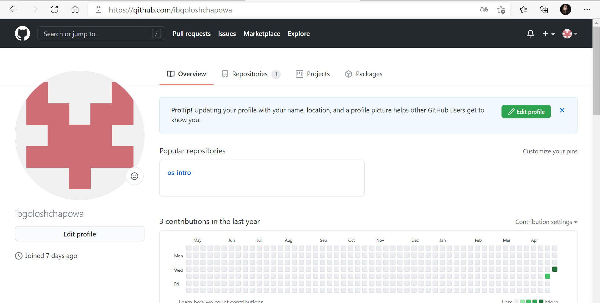

Приступила к настройке  системы контроля версий git, как это было описано в указаниях к лабораторной работе с использованием сервера репозиториев  [github](https://githab.com).

2.  «Работа с сервером репозиториев».  Для последующей идентификации пользователя на сервере репозиториев я сгенерировала пару ключей (приватный и открытый).  Для этого я ввела команду (рис.2), вследствие которой ключи сохранились в каталоге  ~/ssh/.

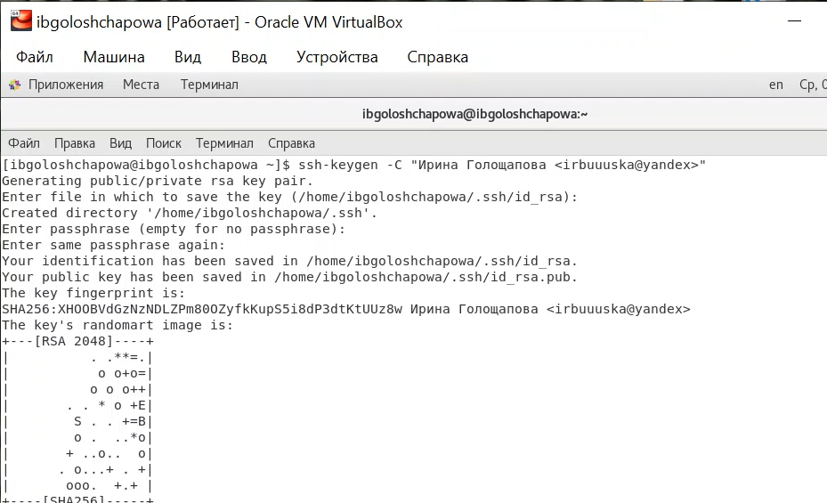

3.  Затем зашла на сайт [github](https://githab.com) под своей учетной записью и перешла в меню «GitHub settings» (рис.3). После этого выбрала в боковом меню «SSH-ключи» (рис.4) и нажала кнопку «Добавить ключ» (рис.5):

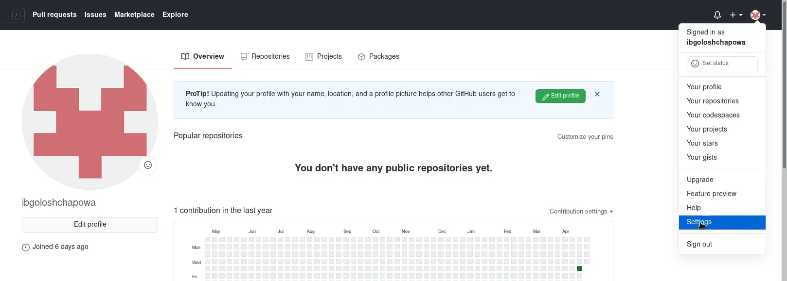

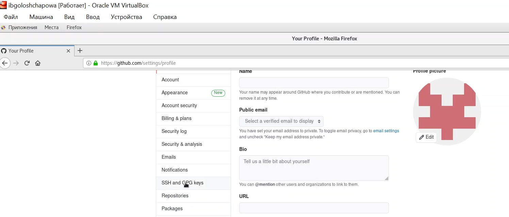

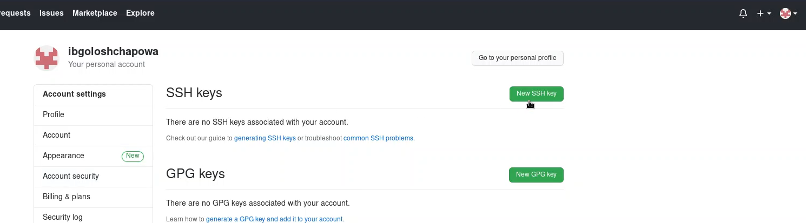

4.  Перешла в терминал и набрала следующую команду (рис.6), после чего скопировала из локальной консоли ключ в буфер обмена (рис.7):

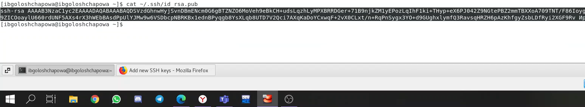
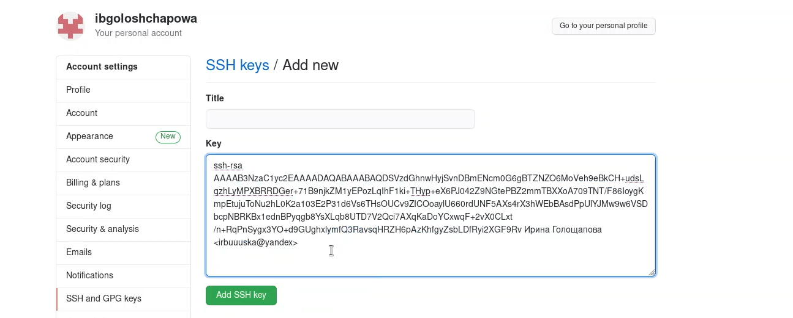

В итоге мы добавили новый ключ – «key1» (рис.8):

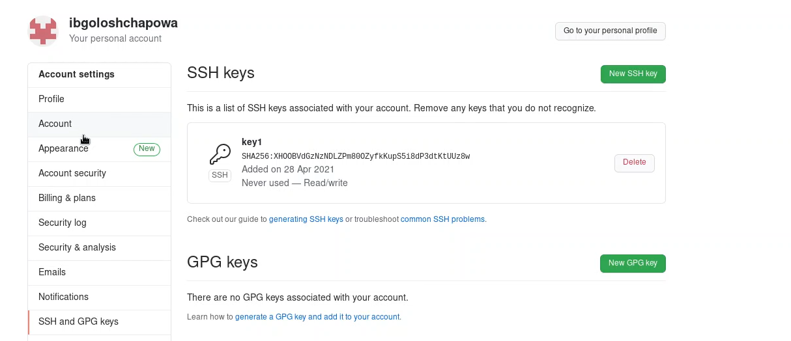

5.  Создала структуру каталога лабораторных работ согласно пункту М.2 (рис.9)

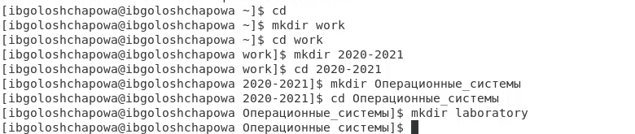

6.  Создала на github репозиторий os-intro (рис.10)

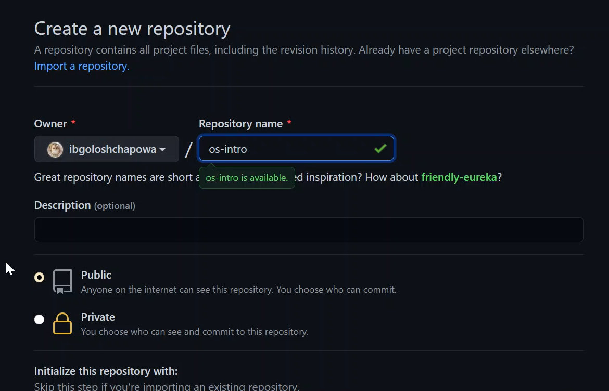

7.  Инициализировала системы git (рис.11 ), создала заготовку для файла README.md, сделала первый коммит и выложила на github (рис.12-14)

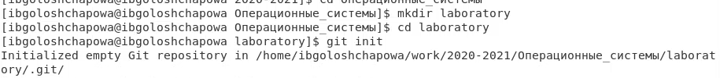

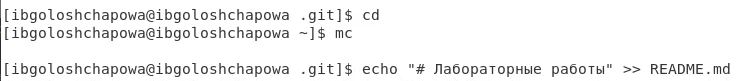

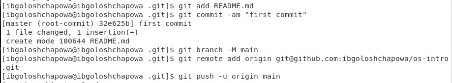

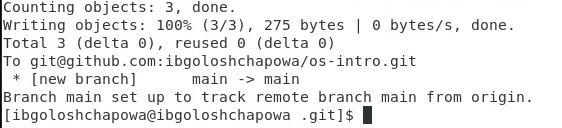

8.  Добавила файл лицензии (рис.15):

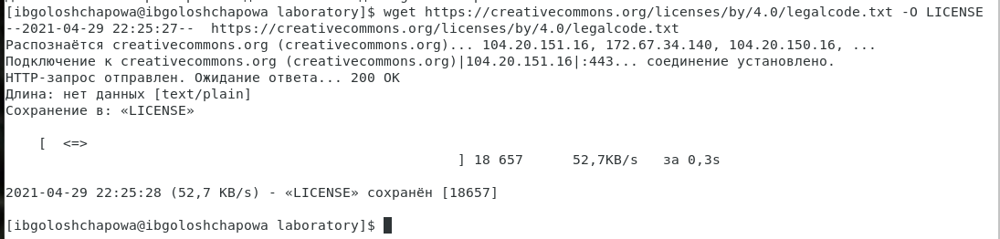

9.  Добавила шаблон игнорируемых файлов. Просмотрела список имеющихся шаблонов (рис.16)

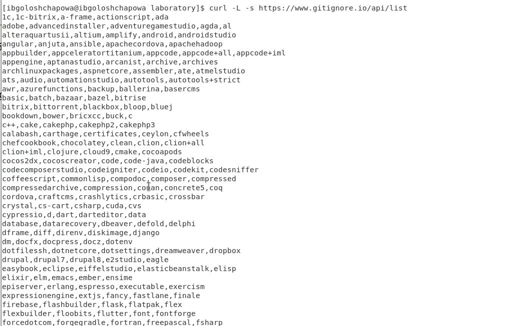

10.  Скачала шаблон для С (рис.17)

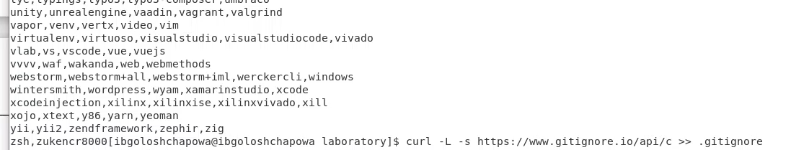

11.  Добавила новые файлы, выполнила коммит и отправила на github (рис.18)

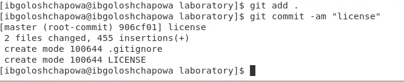

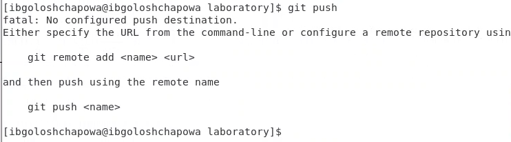

12.  Инициализировала git-flow (префикс для ярлыков установила в v) (рис.19). Также проверила, что нахожусь на ветке develop.

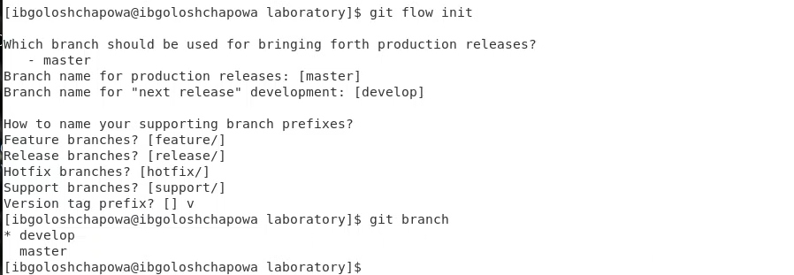

13.  Создала релиз с версией 1.0.0 (рис.20)

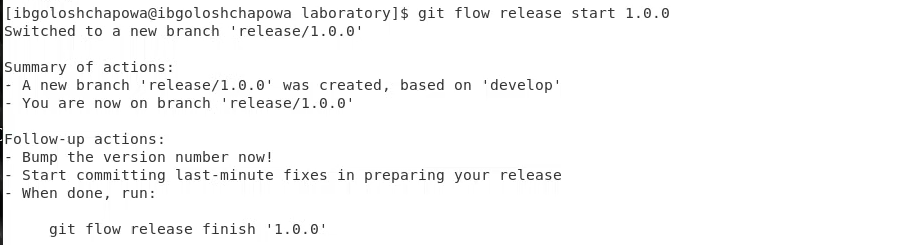

14.  Записала версию, добавила в индекс, залила релизную ветку в основную ветку и отправила данные на github (рис.21).

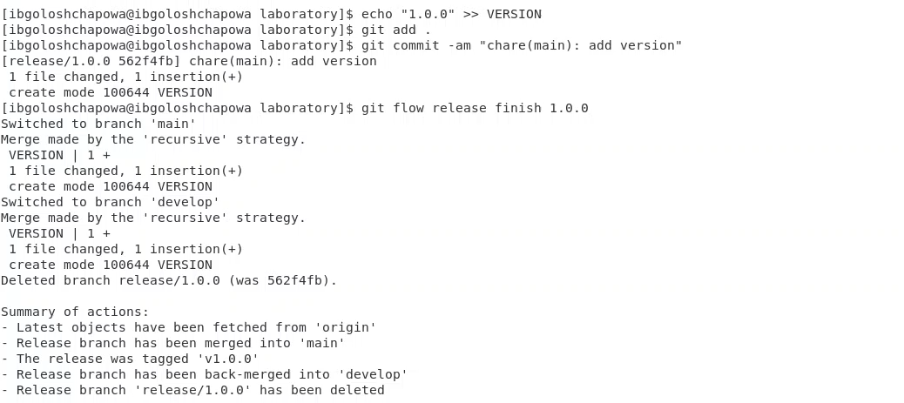

15.  Обновила github (рис.22-23)

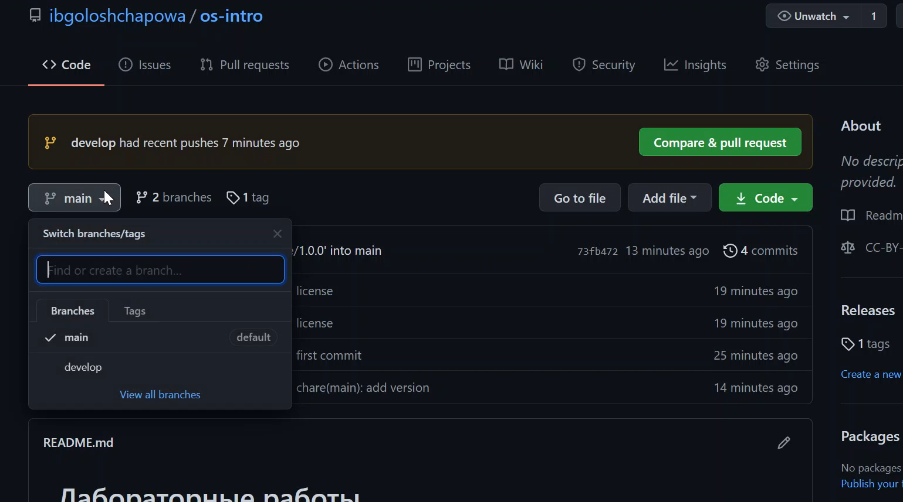

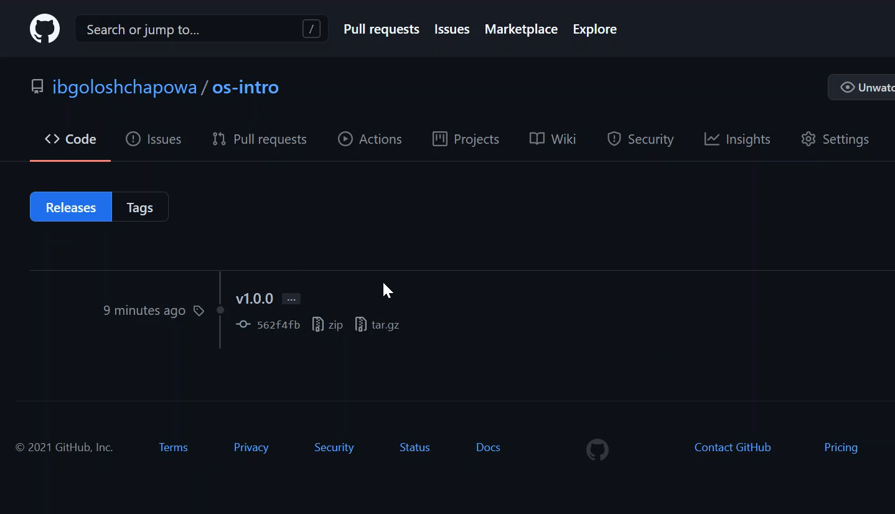

# Вывод
В ходе лабораторной работы я изучила идеологию и применение средств контроля версий (VCS). Научилась настраивать систему контроля версий с использованием сервера репозиториев на ПК.

# Ответы на контрольные вопросы
1.  Что такое системы контроля версий и для решения каких задач они предназначаются?

**Ответ:**
Система контроля версий (Version Control System, VCS) представляет собой программное обеспечение, которое позволяет отслеживать изменения в документах, при необходимости производить их откат, определять, кто и когда внес исправления и т.п. Также важно отметить, что системы контроля версий применяются и для хранения исходного кода, для хранения файлов совершенно любого типа.

2.  Объясните следующие понятия VCS и их отношения: хранилище, commit, история, рабочая копия.

**Ответ:** Хранилище (repository) – место хранения файлов и их версий, служебной информации. 
Commit – процесс создания новой версии; иногда синоним версии.  
История – одна из самых важных частей git, где сохраняются все коммиты, по которым можно посмотреть автора коммита, commite message, дфту коммита и его хэш.
Рабочая копия – текущее состояние файлов проекта (любой версии), полученных из хранилища и, возможно, измененных.

3.  Что представляют собой и чем отличаются централизованные и децентрализованные VCS? Приведите примеры VCS каждого вида.

**Ответ:** В централизованной системе управления версий код хранится на сервере. Все разработчики в команде имеют доступ к централизованному хранилищу. Однако у разработчика нет своего локального репозитория, а есть только копия данных с сервера. В случае выхода их строя сервера команда не сможет продолжить работу над проектом. Еще один минус использования централизованной системы управления версиями заключается в сложности доступа к одному ресурсу одновременно несколькими разработчиками.

Примеры централизованных VCS: CVS (Система одновременных версий), Subversion (SVN).

В децентрализованной (распределенной) системе управления версий, кроме версии репозитория на сервере, у каждого разработчика есть свой репозиторий. При этом можно выделить центральный репозиторий (условно), в который будут отправляться изменения из локальных, и с ним же эти локальные репозитории будут синхронизироваться. При работе с такой системой пользователи периодически синхронизируют свои локальные репозитории с центральным и работают непосредственно со своей локальной копией. После внесения достаточного количества изменений в локальную копию они (изменения) отправляются на сервер.

Примеры распределенных VCS: Git, Mercurial.

4.  Опишите действия с VCS при единоличной работе с хранилищем.

**Ответ:**
На самом деле действий может быть очень много. Например, можно делать commit, хранить файлы проекта в репозитории, делать релизы

5.  Опишите порядок работы с общим хранилищем VCS.

**Ответ:** Пользователь перед началом работы с помощью определённых команд получает нужную ему версию файлов. После внесения изменений, пользователь размещает новую версию в хранилище. Можно объединить (слить) изменения, сделанные разными участниками (сделать это автоматически или вручную), вручную выбрать нужную версию, отменить изменения вовсе или заблокировать файлы для изменения.

6.  Каковы основные задачи, решаемые инструментальным средством git? 

**Ответ:**
У Git есть две основные задачи: хранить информацию обо всех изменениях в коде, начиная с самой первой строчки, и обеспечить удобства командной работы над кодом.

7.  Назовите и дайте краткую характеристику командам git. 

**Ответ:**

- создание основного дерева репозитория: git init 
- получение обновлений (изменений) текущего дерева из центрального репозитория: git pull
- отправка всех произведённых изменений локального дерева в центральный репозиторий: git push
- просмотр списка изменённых файлов в текущей директории: git status 
- просмотр текущих изменения: git diff 
- сохранение текущих изменений: 
- добавить все изменённые и/или созданные файлы и/или каталоги: git add . 
- добавить конкретные изменённые и/или созданные файлы и/или каталоги: git add имена_файлов 
- удалить файл и/или каталог из индекса репозитория (при этом файл и/или каталог остаётся в локальной директории): git rm имена_файлов 
- сохранение добавленных изменений:
- сохранить все добавленные изменения и все изменённые файлы: git commit -am 'Описание коммита' 
- сохранить добавленные изменения с внесением комментария через встроенный редактор: git commit
- создание новой ветки, базирующейся на текущей: git checkout -b имя_ветки 
- переключение на некоторую ветку: git checkout имя_ветки (при переключении на ветку, которой ещё нет в локальном репозитории, она будет создана и связана с удалённой) 
- отправка изменений конкретной ветки в центральный репозиторий: git push origin имя_ветки 
- слияние ветки с текущим деревом: git merge --no-ff имя_ветки 
- удаление ветки: 
- удаление локальной уже слитой с основным деревом ветки: git branch -d имя_ветки
- принудительное удаление локальной ветки: git branch -D имя_ветки
- удаление ветки с центрального репозитория: git push origin :имя_ветки

8.  Приведите примеры использования при работе с локальным и удалённым репозиториями. 

**Ответ:**
•  Если в проекте закрыт исходный код, то здесь удобно использовать локальный репозиторий. Также локальный репозиторий удобен для одиночного проекта.
•   Проекты с открытым кодом или выполняемые группой людей удобно хранить на удаленном репозитории

9.  Что такое и зачем могут быть нужны ветви (branches)? 

**Ответ:**
‘Git branch’ – это команда для управления ветками в репозитории Git.
Ветка – это просто «скользящий» указатель на один из коммитов. Когда мы создаём новые коммиты, указатель ветки автоматически сдвигается вперёд, к вновь созданному коммиту.
Ветки используются для разработки одной части функционала изолированно от других. Каждая ветка представляет собой отдельную копию кода проекта. Ветки позволяют одновременно работать над разными версиями проекта.

10.  Как и зачем можно игнорировать некоторые файлы при commit?

**Ответ:**
Игнорируемые файлы – это, как правило, специфичные для платформы файлы или автоматически созданные файлы из систем сборки. 
.gitignore – это простой текстовый файл, в каждой строке которого содержится шаблон файла или каталога, который необходимо проигнорировать.
Строки, начинающиеся со знака #, являются комментариями и игнорируются. Пустые строки могут быть использованы для улучшения читабельности файла и группировки связанных строк шаблонов.
