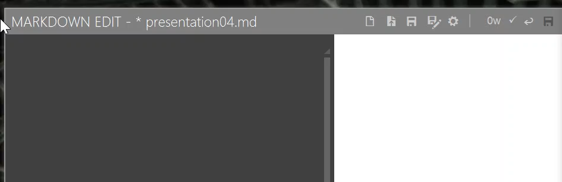

---
# Front matter
lang: ru-RU
title: "Отчёт по лабораторной работе №3"
subtitle: "Markdown"
author: "Голощапова Ирина Борисовна"

---

# Цель работы

Научиться оформлять отчёты с помощью легковесного языка разметки Markdown

# Ход работы

1. Ознакомилась с языком Markdown. Запомнила основные правила написания.
2. Открыла Markdown Edit (рис.1)

3. Написала отчёт по лабораторной работе №2 на языке Markdown (рис.2)

4. Конвертировала из md в pdf, docx (рис.3)

# Вывод 
В ходе лабораторной работы я научилась оформлять отчёты с помощью легковесного языка разметки Markdown.
