---
# Front matter
lang: ru-RU
title: "Отчёт по лабораторной работе №5"
subtitle: "Основы интерфейса взаимодействия пользователя с системой Unix на уровне командной строки"
author: "Голощапова Ирина Борисовна"

---

# **Цель работы**
Приобретение практических навыков взаимодействия пользователя с системой посредством командной строки.
______

# **Ход работы:**
1. Определила полное имя моего домашнего каталога (Рисунок 1). 

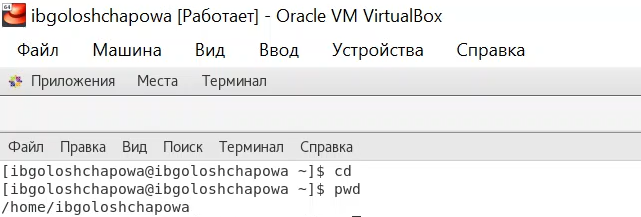

**Рисунок 1 “Полное имя домашнего каталога”**

2. Выполнила следующие действия: 
-  Перешла в каталог /tmp ( Рисунок 2). 

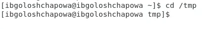

**Рисунок 2 «Переход в каталог /tmp»**

- Вывела на экран содержимое каталога /tmp. Для этого использовала команду ls с различными опциями. Ниже поясните разницу в выводимой на экран информации. (Рисунок 3)
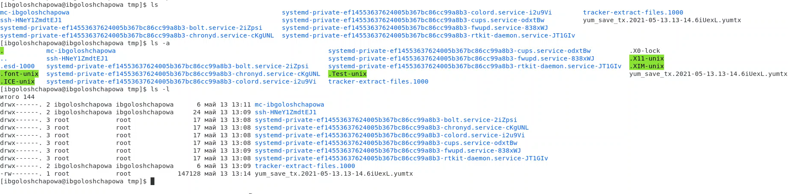

**Рисунок 3 "Вывод содержимого каталога"**

*ls -a отображает имена скрытых файлов;*

*ls -l полная информация о файлах и каталогах.*

- Определила, есть ли в каталоге /var/spool подкаталог с именем cron. (Рисунок 4).

*Да, есть:*

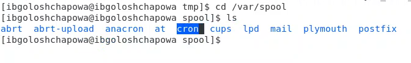

**Рисунок 4 "Наличие каталога"**

- Перешла в домашний каталог и вывела на экран его содержимое (Рисунок 5).
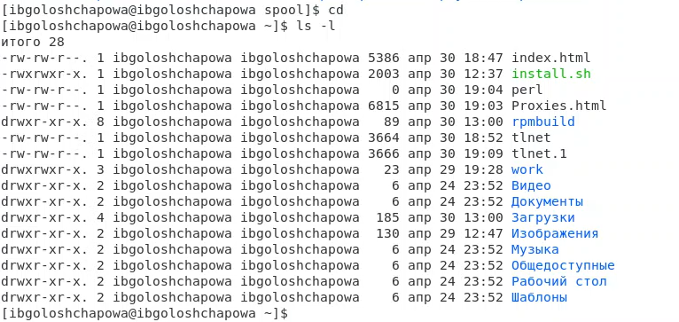

**Рисунок 5 "Содержание домашнего каталога"**

Определила с помощью команды ls –l, кто является владельцем файлов и подкаталогов – *ibgoloshchapowa*.

3. Выполнила следующие действия: 
- В домашнем каталоге создала новый каталог с именем newdir (Рисунок 6). 
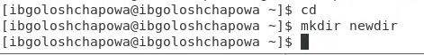

**Рисунок 6 "Создание каталога newdir"**

- В каталоге ~/newdir создала новый каталог с именем morefun (Рисунок 7). 

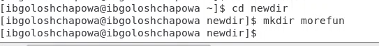

**Рисунок 7 "Создание каталога morefun"**

  - В домашнем каталоге создала одной командой три новых каталога с именами letters, memos, misk (Рисунок 8). Затем удалила эти каталоги одной командой (Рисунок 9).

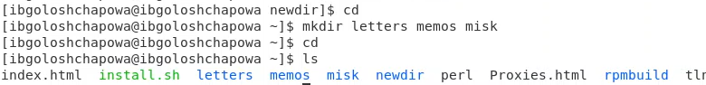

**Рисунок 8 "Создание трех каталогов"**

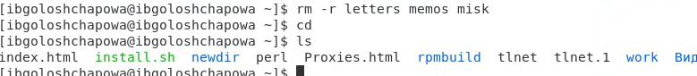

**Рисунок 9 "Удаление трех каталогов"**

  - Удалила ранее созданный каталог ~/newdir командой rm -r. Убедилась, что он действительно был удалён (Рисунок 10). 
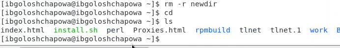

**Рисунок 10 "Удаление каталога ~/newdir"**

   - Каталог ~/newdir/morefun из домашнего каталога я удалила в предыдущем задании, так как воспользовалась командой удаления непустого каталога. 

4. С помощью команды man (Рисунок 11) определила, что опцию -R  команды ls нужно использовать для просмотра содержимое не только указанного каталога, но и подкаталогов, входящих в него (Рисунок 12).

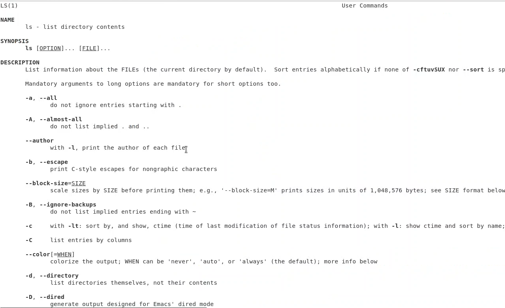

**Рисунок 11 "man ls"**

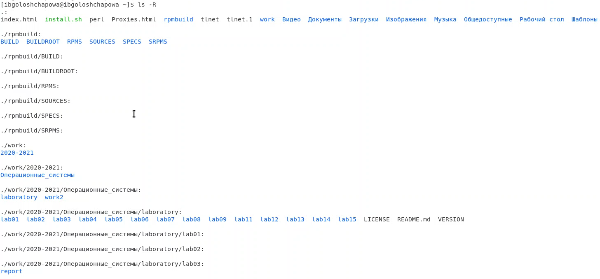

**Рисунок 12 "ls -R"**

5. С помощью команды man определила, что опции -tl команды ls, позволяют отсортировать по времени последнего изменения выводимый список содержимого каталога с развёрнутым описанием файлов (Рисунок 13). 

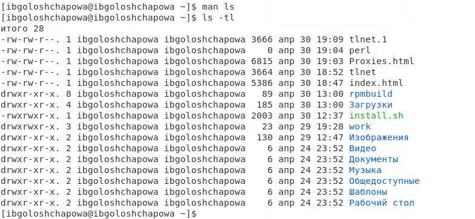

**Рисунок 13 "ls -tl"**

6. Использовала команду man для просмотра описания следующих команд: cd (Рисунок 14), pwd(Рисунок 16), mkdir (Рисунок 15), rmdir (Рисунок 14), rm (Рисунок 18). Ниже пояснила основные опции этих команд. 

**man rmdir:** 

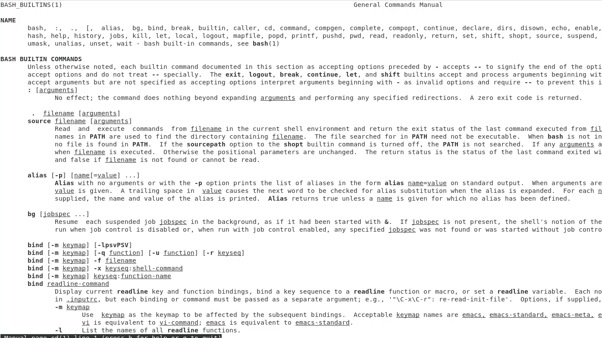

**Рисунок 14 "man rmdir"**
**

**man mkdir:**
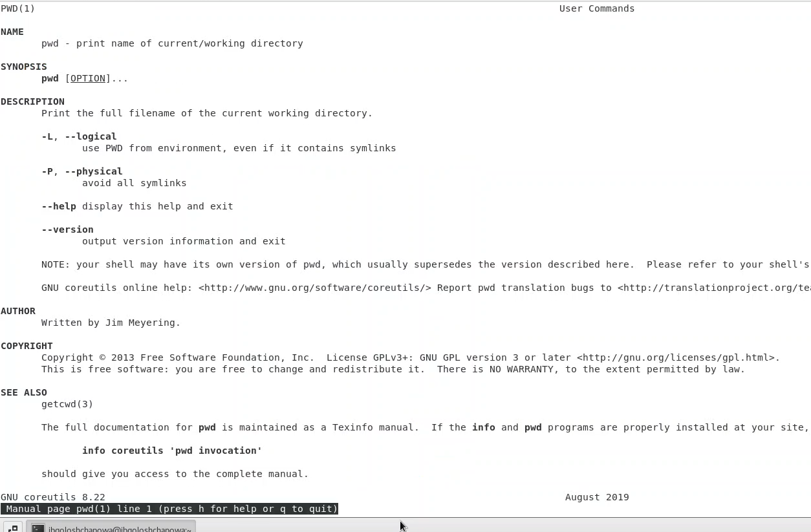

**Рисунок 15 "man mkdir"**

**man pwd:**

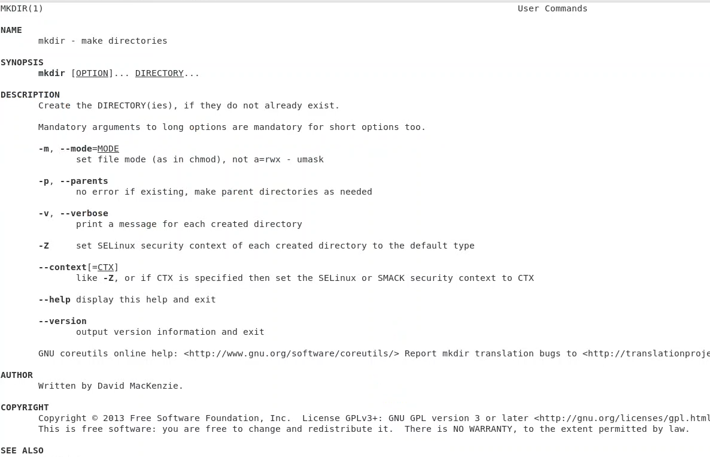

**Рисунок 16 "man pwd"**

**man cd:**

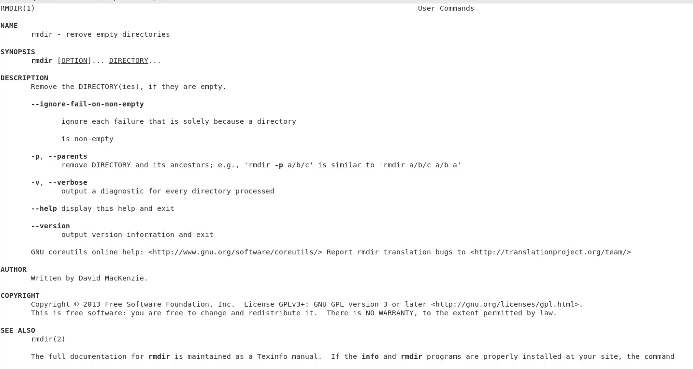

**Рисунок 17 "man cd"**

**man rm:**

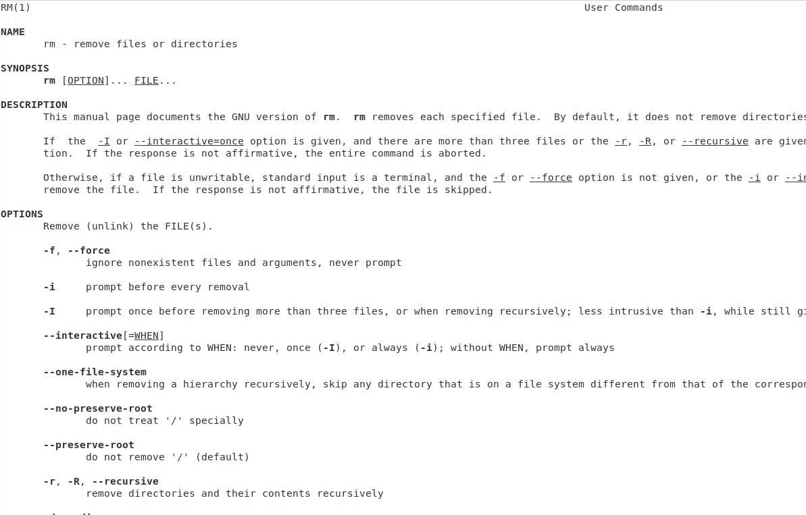

**Рисунок 18 "man rm"**

7. Используя информацию, полученную при помощи команды history (Рисунок 19), выполнила модификацию и исполнение нескольких команд из буфера команд (Рисунок 20).

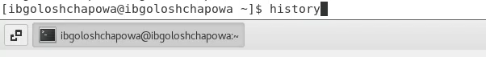

**Рисунок 19 "history"**

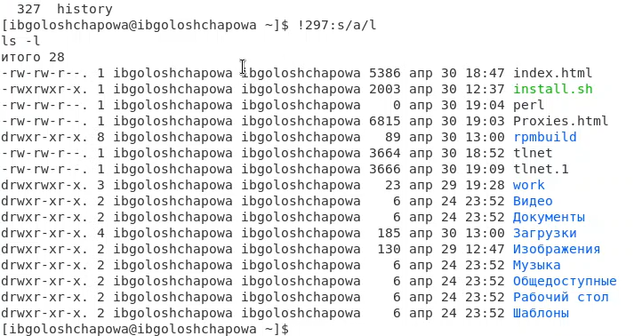

**Рисунок 20 "модификация "**
#
# **Вывод**

В ходе лабораторной работы я приобрела практические навыки взаимодействия пользователя с системой посредством командной строки.  Изучила самые необходимые команды для работы с файлами и каталогами и запомнила их синтаксис.
# **Ответы на контрольные вопросы**

1. *Что такое командная строка?*  

>Командная строка (консоль или Терминал) – это специальная программа, которая позволяет управлять компьютером путем ввода текстовых команд с клавиатуры.

2. *При помощи какой команды можно определить абсолютный путь текущего каталога? Приведите пример.* 

>При помощи команды realpath можно определить абсолютный путь текущего каталога. Например, если вбить realpath var на экран выведется /home/<username>/var.

3. *При помощи какой команды и каких опций можно определить только тип файлов и их имена в текущем каталоге? Приведите примеры.* 

>При помощи команды ls -F можно определить только тип файлов и их имена в текущем каталоге.

4. *Какие файлы считаются скрытыми? Как получить информацию о скрытых файлах? Приведите примеры.*

>Файл считается скрытым, если его название начинается с символа точка «.». Например, «.myfile». Обычно такие файлы используются приложениями для хранения настроек, конфигураций и другой информации, которую нужно скрыть от пользователя

5. *При помощи каких команд можно удалить файл и каталог? Можно ли это сделать одной и той же командой? Приведите примеры.* 

>При помощи команд rm и rmdir можно удалить файл и каталог. Это нельзя сделать одной и той же командой. rmdir используется, чтобы удалить файлы, которые должны быть пустые. rm используется, чтобы удалить непустые файлы или целые деревья каталогов.

6. *Как определить, какие команды выполнил пользователь в сеансе работы?*

>При помощи команды history.

7. *Каким образом можно исправить и запустить на выполнение команду, которую пользователь уже использовал в сеансе работы? Приведите примеры.* 

>С помощью следующей команды: !<номер\_команды>:s/<что\_меняем>/<на\_что\_меняем> 

Например:

`history

3 ls -a .

!3:s/a/F

ls -F`

8. *Можно ли в одной строке записать несколько команд? Если да, то как? Приведите примеры.* 

>В одной строке можно записать несколько команд. Если требуется выполнить последовательно несколько команд, записанный в одной строке, то для этого используется символ точка с запятой. Пример: cd; ls.

9. *Что такое символ экранирования? Приведите примеры использования этого символа.* 

>Экранирование — это способ заключения в кавычки одиночного символа. Экранирующий символ (\) сообщает интерпретатору, что следующий за ним символ должен восприниматься как обычный символ. Пример:

echo "Привет" # Привет

echo "Он сказал: \"Привет\"." # Он сказал: "Привет".

10. *Какая информация выводится на экран о файлах и каталогах, если используется опция l в команде ls?* 

>Если используется опция l в команде ls, то на экран выводится подробный список, в котором будет отображаться владелец, группа, дата создания, размер и другая информация о файлах и каталогах.

11. *Что такое относительный путь к файлу? Приведите примеры использования относительного и абсолютного пути при выполнении какой-либо команды.* 

>Относительный путь – это путь к файлу относительно текущей папки. При использовании команды pwd на экран выведется относительный путь текущей директории, а при использовании команды realpath на экран выведется абсолютный путь текущей директории.

12. *Как получить информацию об интересующей вас команде?* 

>С помощью команды man.

13. *Какая клавиша или комбинация клавиш служит для автоматического дополнения вводимых команд.*

>Команда *Alt+?* позволяет вывести все варианты дополнения.

