---
# Front matter
lang: ru-RU
title: "Лабораторная работа №6"
subtitle: "Анализ файловой системы Linux. Команды для работы с файлами и каталогами"
author: "Ирина Борисовна Голощапова"

# Formatting
toc-title: "Содержание"
toc: true # Table of contents
toc_depth: 2
lof: true # List of figures
lot: true # List of tables
fontsize: 12pt
linestretch: 1.5
papersize: a4paper
documentclass: scrreprt
polyglossia-lang: russian
polyglossia-otherlangs: english
mainfont: PT Serif
romanfont: PT Serif
sansfont: PT Sans
monofont: PT Mono
mainfontoptions: Ligatures=TeX
romanfontoptions: Ligatures=TeX
sansfontoptions: Ligatures=TeX,Scale=MatchLowercase
monofontoptions: Scale=MatchLowercase
indent: true
pdf-engine: lualatex
header-includes:
  - \linepenalty=10 # the penalty added to the badness of each line within a paragraph (no associated penalty node) Increasing the value makes tex try to have fewer lines in the paragraph.
  - \interlinepenalty=0 # value of the penalty (node) added after each line of a paragraph.
  - \hyphenpenalty=50 # the penalty for line breaking at an automatically inserted hyphen
  - \exhyphenpenalty=50 # the penalty for line breaking at an explicit hyphen
  - \binoppenalty=700 # the penalty for breaking a line at a binary operator
  - \relpenalty=500 # the penalty for breaking a line at a relation
  - \clubpenalty=150 # extra penalty for breaking after first line of a paragraph
  - \widowpenalty=150 # extra penalty for breaking before last line of a paragraph
  - \displaywidowpenalty=50 # extra penalty for breaking before last line before a display math
  - \brokenpenalty=100 # extra penalty for page breaking after a hyphenated line
  - \predisplaypenalty=10000 # penalty for breaking before a display
  - \postdisplaypenalty=0 # penalty for breaking after a display
  - \floatingpenalty = 20000 # penalty for splitting an insertion (can only be split footnote in standard LaTeX)
  - \raggedbottom # or \flushbottom
  - \usepackage{float} # keep figures where there are in the text
  - \floatplacement{figure}{H} # keep figures where there are in the text
---

# Цель работы

Ознакомление с файловой системой Linux, её структурой, именами и содержанием каталогов. Приобретение практических навыков по применению команд для
работы с файлами и каталогами, по управлению процессами (и работами), по проверке использования диска и обслуживанию файловой системы.


# Задачи:
 - Ознакомиться с файловой системой Linux.
 - ОТработать применение команд для работы с файлами и каталогами


________
# Выполнение лабораторной работы
## Задания по mc:

1. Выполнила все примеры, приведённые в первой части описания лабораторной
работы:

 - Создала файл ```abc1```  в домашнем каталоге

{ #fig:001 width=70% }

 - Создала файлы ```april``` и ```may``` и выполнила команду копирования:

{ #fig:001 width=70% }

 - Создала каталог ```monthly``` и скопировала в него созданные в предыдущем пунке файлы

{ #fig:001 width=70% }


 - Выполнила команду ```cp monthly/may monthly/june``` :

{ #fig:001 width=70% }


 - Создала каталог monthly.00 и скопировала в него каталог monthly

{ #fig:001 width=70% }

 - Скопировала каталог monthly в каталог /tmp


{ #fig:001 width=70% }

 - Воспользовалась командой изменения названия файлов:


{ #fig:001 width=70% }

 - Воспользовалась командой перемещения каталогов:


{ #fig:001 width=70% }

2. Выполнила следующие действия, зафиксировав в отчёте по лабораторной работе
используемые при этом команды и результаты их выполнения:
 - Скопировала файл ```/usr/include/sys/io.h``` в домашний каталог и назвала
его equipment. 

{ #fig:001 width=70% }

 - В домашнем каталоге создала директорию ```~/ski.plases```.

{ #fig:001 width=70% }

- Переместила файл equipment в каталог ```~/ski.plases```.
 
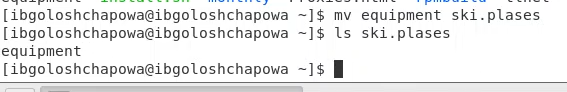{ #fig:001 width=70% } 
 
 - Переименовала файл ~/ski.plases/equipment в ```~/ski.plases/equiplist```.

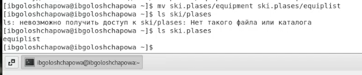{ #fig:001 width=70% }

- Создала в домашнем каталоге файл abc1 и скопировала его в каталог ```~/ski.plases```, назвала его ```equiplist2```.
 
 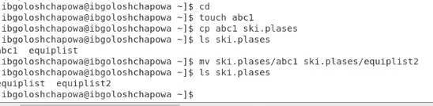{ #fig:001 width=70% }
- Создала каталог с именем equipment в каталоге ```~/ski.plases```.

{ #fig:001 width=70% }

- Переместила файлы ~/ski.plases/equiplist и equiplist2 в каталог ```~/ski.plases/equipment```.

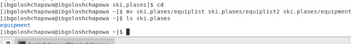{ #fig:001 width=70% }

- Создала и переместила каталог ```~/newdir``` в каталог ```~/ski.plases``` и назовла его ```plans```.
 
 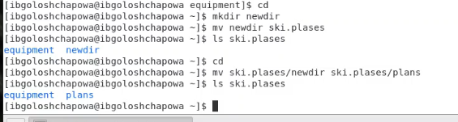{ #fig:001 width=70% }
 
3. Определила опции команды chmod, необходимые для того, чтобы присвоить перечисленным ниже файлам выделенные права доступа, считая, что в начале таких прав нет:

 - ```drwxr--r--``` ... australia
 
  { #fig:001 width=70% }
 
 - ```drwx--x--x``` ... play
 
 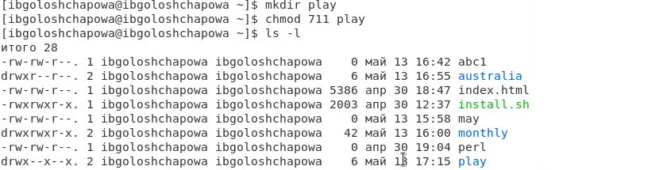{ #fig:001 width=70% }

-  ```-r-xr--r--``` ... my_os
-  ```-rw-rw-r--``` ... feathers
 
 { #fig:001 width=70% }


4. Проделала приведённые ниже упражнения, записывая в отчёт по лабораторной
работе используемые при этом команды:

 - Просмотрела содержимое файла ```/etc/password```.

 { #fig:001 width=70% }

- Скопировала файл ```~/feathers в файл ~/file.old```.
 
  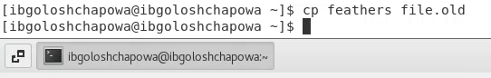{ #fig:001 width=70% }
 
 - Переместила файл ```~/file.old``` в каталог ```~/play```.
 
  { #fig:001 width=70% }
 
 - Скопировала каталог ```~/play``` в каталог ```~/fun```.
 
  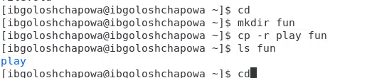{ #fig:001 width=70% }
 
 - Переместила каталог ```~/fun``` в каталог ```~/play``` и назвала его games.
 
  { #fig:001 width=70% }
 
 - Лишила владельца файла ```~/feathers``` права на чтение.
 
  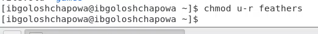{ #fig:001 width=70% }
 
 - Попыталась просмотреть файл ```~/feathers``` командой ```cat```. В итоге было отказано в доступе.

 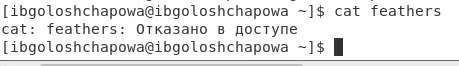{ #fig:001 width=70% }

- Попытаетась скопировать файл ```~/feathers```. Было отказано в доступе.

- Дайла владельцу файла ```~/feathers``` право на чтение.

 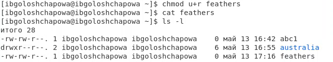{ #fig:001 width=70% }

- Лишила владельца каталога ```~/play``` права на выполнение.

 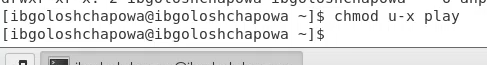{ #fig:001 width=70% }

- Перешла в каталог ```~/play```. Что произошло?

 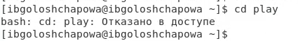{ #fig:001 width=70% }

- Дала владельцу каталога ```~/play``` право на выполнение.

 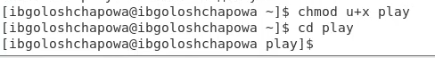{ #fig:001 width=70% }

5. Прочитала man по командам ```mount```, ```fsck```, ```mkfs```, ```kill``` и кратко их охарактеризуйте, приведя примеры.

```man mount```:

 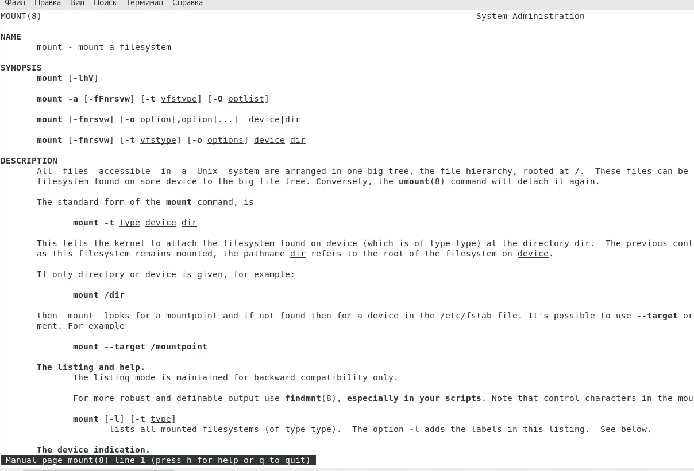{ #fig:001 width=70% }
 
 ```man fsck```:
 
  { #fig:001 width=70% }
  
 ```man mkfs```:
 
  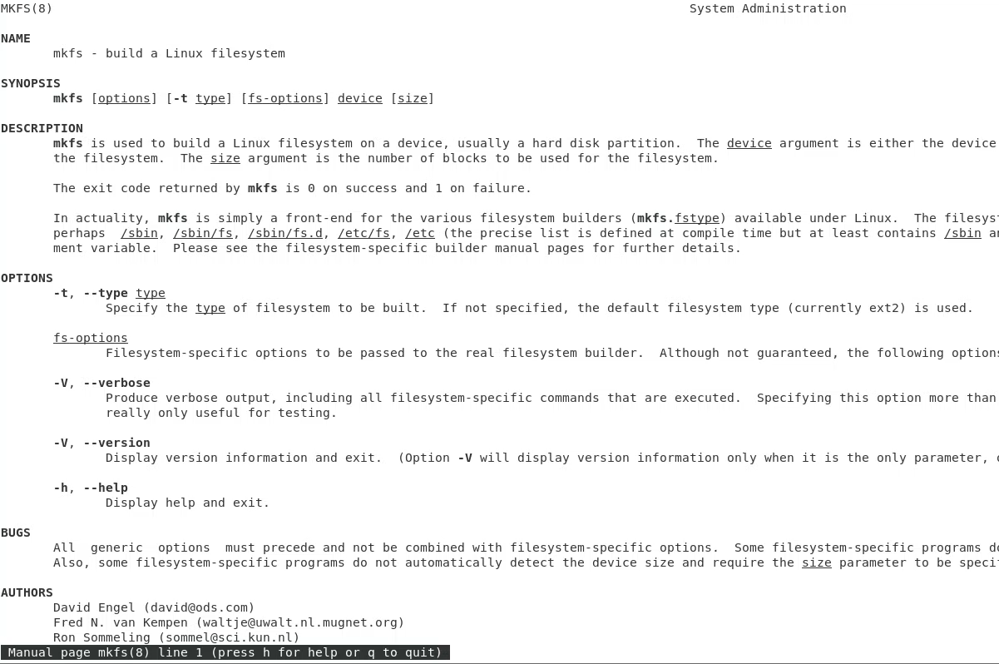{ #fig:001 width=70% }
  
 ```man kill```:
 
  { #fig:001 width=70% }


# Выводы

В ходе лабораторной работы я ознакомилась с файловой системой Linux, её структурой, именами и содержанием каталогов. Приобрела практические навыкы по применению команд для
работы с файлами и каталогами, по управлению процессами (и работами), по проверке использования диска и обслуживанию файловой системы


# Ответы на контрольные вопросы:
 
1.Дайте характеристику каждой файловой системе, существующей на жёсткомдиске компьютера, на котором вы выполняли лабораторную работу.

> Файлы: abc1, april, may, june, july, isdv4.h, equipment, equiplist, equiplist2, my_os, feathers, file.old. Каталоги: monthly, monthly.00, tmp, monthly.01, reports, usr, include, xorg, ski.plases, equipment, newdir, plans, australia, play, etc, fun, games.

2.Приведите общую структуру файловой системы и дайте характеристику каждой директории первого уровня этой структуры.
> /home/pdarzhankina/monthly/april, где /home/pdarzhankina – домашний каталог, /monthly – каталог, находящийся в домашнем и содержащий файл, /аpril – файл, находящийся в каталоге.

3. Какая операция должна быть выполнена, чтобы содержимое некоторой файловойсистемы было доступно операционной системе?

> Чтобы содержимое некоторой файловой системы было доступно операционной системе должно быть выполнено монтирование тома.

4. Основные причины нарушения целостности файловой системы:

> - Один блок адресуется несколькими mode (принадлежит нескольким файлам).

> - Блок помечен как свободный, но в то же время занят (на него ссылается onode).

> - Блок помечен как занятый, но в то же время свободен (ни один inode на него не ссылается).

> - Неправильное число ссылок в inode (недостаток или избыток ссылающихся записей в каталогах).

> - Несовпадение между размером файла и суммарным размером адресуемых inode блоков.

> - Недопустимые адресуемые блоки (например, расположенные за пределами файловой системы).

> - "Потерянные" файлы (правильные inode, на которые не ссылаются записи каталогов).

> - Недопустимые или неразмещенные номера inode в записях каталогов.

> Чтобы устранить повреждения файловой системы используется команда ```fsck```.


5. Команда ```mkfs``` создаёт новую файловую систему.

6. Характеристика команд, которые позволяют просмотреть текстовые файлы:

> - для просмотра небольших файлов удобно пользоваться командой ```cat```.

> - для просмотра больших файлов используйте команду ```less``` — она позволяет осуществлять постраничный просмотр файлов.

> - для просмотра начала файла можно воспользоваться командой head, по умолчанию она выводит первые 10 строк файла.

> - команда ```tail``` выводит несколько (по умолчанию 10) последних строк файла.


7. Основные возможности команды ```cp```:

> - копирование файла в текущем каталоге.

> - копирование нескольких файлов в каталог.

> - копирование файлов в произвольном каталоге.

> Опция i в команде cp выведет на экран запрос подтверждения о перезаписи файла, если на место целевого файла вы поставите имя уже существующего файла.

> Команда cp с опцией r (recursive) позволяет копировать каталоги вместе с входящими в них файлами и каталогами.


8. Характеристика команд перемещения и переименования файлов и каталогов:

> - переименование файлов в текущем каталоге.

> mv <старое_название_файла> <новое_название_файла>

> - перемещение файлов в другой каталог.

> mv <название_файла> <название_каталога>

> Если необходим запрос подтверждения о перезаписи файла, то нужно использовать опцию i.

> - переименование каталогов в текущем каталоге.

> mv <старое_название_каталога> <новое_название_каталога>

> - перемещение каталога в другой каталог.

> mv <старый_каталога> <новый_каталог>

> - переименование каталога, не являющегося текущим.

> mv <каталог/старое_название_каталога> < каталог/новое_название_каталога>

9. Каждый файл или каталог имеет права доступа: чтение (разрешены просмотр и копирование файла, разрешён просмотр списка входящих в каталог файлов), запись (разрешены изменение и переименование файла, разрешены создание и удаление файлов каталога), выполнение (разрешено выполнение файла, разрешён доступ в каталог и есть возможность сделать его текущим) Они могу быть изменены командой chmod.
