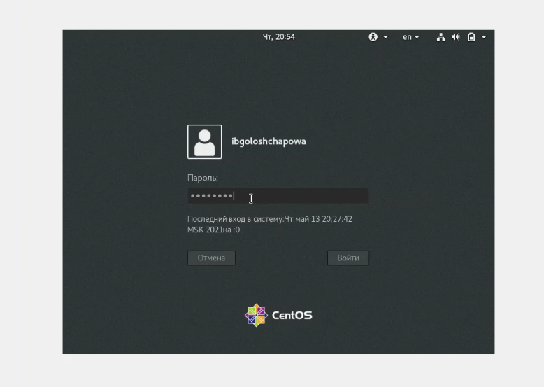
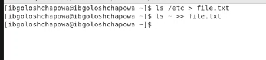
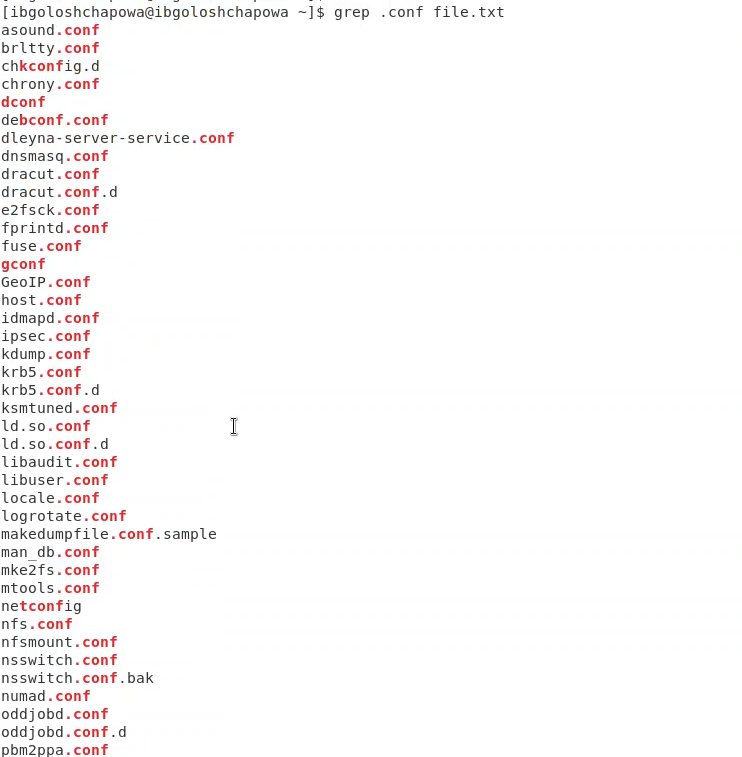
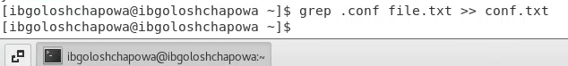
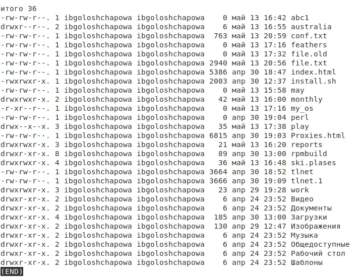
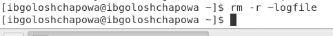

---
# Front matter
lang: ru-RU
title: "Лабораторная работа №8"
subtitle: "Командная оболочка Midnight Commander"
author: "Ирина Борисовна Голощапова"

# Formatting
toc-title: "Содержание"
toc: true # Table of contents
toc_depth: 2
lof: true # List of figures
lot: true # List of tables
fontsize: 12pt
linestretch: 1.5
papersize: a4paper
documentclass: scrreprt
polyglossia-lang: russian
polyglossia-otherlangs: english
mainfont: PT Serif
romanfont: PT Serif
sansfont: PT Sans
monofont: PT Mono
mainfontoptions: Ligatures=TeX
romanfontoptions: Ligatures=TeX
sansfontoptions: Ligatures=TeX,Scale=MatchLowercase
monofontoptions: Scale=MatchLowercase
indent: true
pdf-engine: lualatex
header-includes:
  - \linepenalty=10 # the penalty added to the badness of each line within a paragraph (no associated penalty node) Increasing the value makes tex try to have fewer lines in the paragraph.
  - \interlinepenalty=0 # value of the penalty (node) added after each line of a paragraph.
  - \hyphenpenalty=50 # the penalty for line breaking at an automatically inserted hyphen
  - \exhyphenpenalty=50 # the penalty for line breaking at an explicit hyphen
  - \binoppenalty=700 # the penalty for breaking a line at a binary operator
  - \relpenalty=500 # the penalty for breaking a line at a relation
  - \clubpenalty=150 # extra penalty for breaking after first line of a paragraph
  - \widowpenalty=150 # extra penalty for breaking before last line of a paragraph
  - \displaywidowpenalty=50 # extra penalty for breaking before last line before a display math
  - \brokenpenalty=100 # extra penalty for page breaking after a hyphenated line
  - \predisplaypenalty=10000 # penalty for breaking before a display
  - \postdisplaypenalty=0 # penalty for breaking after a display
  - \floatingpenalty = 20000 # penalty for splitting an insertion (can only be split footnote in standard LaTeX)
  - \raggedbottom # or \flushbottom
  - \usepackage{float} # keep figures where there are in the text
  - \floatplacement{figure}{H} # keep figures where there are in the text
---

# Цель работы

Освоение основных возможностей командной оболочки Midnight Commander.
Приобретение навыков практической работы по просмотру каталогов и файлов; манипуляций с ними.


# Задание

Научиться работать в командной оболочке Midnight Commander.
Приобрести навыки работы во встроенном редакторе mc.

________
# Выполнение лабораторной работы
## Задания по mc:

1. Изучила информацию о mc, вызвав в командной строке man mc.

{ #fig:001 width=70% }

2. Запустила из командной строки mc, изучила его структуру и меню.

{ #fig:001 width=70% }

3. Выполнила несколько операций в mc, используя управляющие клавиши
(операции с панелями; выделение/отмена выделения файлов, копирование/перемещение файлов, получение информации о размере и правах доступа
на файлы и/или каталоги и т.п.)

Операции с панелями:

{ #fig:001 width=70% }

Права доступа:

{ #fig:001 width=70% }

Копирование:

{ #fig:001 width=70% }

Удаление:

{ #fig:001 width=70% }

Перемещение:

{ #fig:001 width=70% }

Размер файлов и каталогов:

{ #fig:001 width=70% }

4. Выполнила основные команды меню левой (или правой) панели. Информация о файлах выводится довольно подробно.

Меню панели:

{ #fig:001 width=70% }

Информация о файле:

{ #fig:001 width=70% }

Дерево:

{ #fig:001 width=70% }

Формат списка файлов:

{ #fig:001 width=70% }


5. Используя возможности подменю ```Файл``` , выполнила:

– просмотр содержимого текстового файла;

{ #fig:001 width=70% }

– редактирование содержимого текстового файла (без сохранения результатов
редактирования);

{ #fig:001 width=70% }

– создание каталога;

{ #fig:001 width=70% }

– копирование в файлов в созданный каталог:

{ #fig:001 width=70% }

6. С помощью соответствующих средств подменю ```Команда``` осуществила:
– поиск в файловой системе файла с заданными условиями (например, файла
с расширением .c или .cpp, содержащего строку main);

{ #fig:001 width=70% }

{ #fig:001 width=70% }

– выбор и повторение одной из предыдущих команд;

{ #fig:001 width=70% }

– переход в домашний каталог;

{ #fig:001 width=70% }

– анализ файла меню и файла расширений.

Файл расширений:

{ #fig:001 width=70% }

Файл меню:

{ #fig:001 width=70% }


7. Вызвала подменю ```Настройки``` . Освоила операции, определяющие структуру
экрана mc (Full screen, Double Width, Show Hidden Files и т.д.)ю

{ #fig:001 width=70% }

__________________
## Задания по встроенному редактору mc:

1. Создала текстовой файл text.txt.

{ #fig:001 width=70% }

2. Открыла этот файл с помощью встроенного в mc редактора.

{ #fig:001 width=70% }

3. Вставила в открытый файл небольшой фрагмент текста.

{ #fig:001 width=70% }

4. Проделала с текстом следующие манипуляции, используя горячие клавиши:
4.1. Удалила строку текста при помощи клавиш ```Ctrl+y```

{ #fig:001 width=70% }

4.2. Выделила фрагмент текста и скопировала его на новую строку (```F5```).

{ #fig:001 width=70% }

4.3. Выделила фрагмент текста и перенесла его на новую строку(```F6```).

{ #fig:001 width=70% }

4.4. Сохранила файл.

{ #fig:001 width=70% }

4.5. Отменила последнее действие с помощье сочетания клавиш ```Ctrl+u```

4.6. Перейшла в конец файла (нажав комбинацию клавиш ```Ctrl+x```) и написала некоторый текст.

{ #fig:001 width=70% }

4.7. Перейшла в начало файла (нажав комбинацию клавиш ```Ctrl+z```) и написала некоторый текст.

{ #fig:001 width=70% }

4.8. Сохранила и закрыла файл при помощи клавиши ```F10```.

5. Открыла файл с исходным текстом на некотором языке программирования (на языке С++)

{ #fig:001 width=70% }

6. Используя меню редактора, выключила подсветку синтаксиса (сочетание ```Ctrl+s```).

{ #fig:001 width=70% }


# Выводы

В ходе лабораторной работы я освоила основные возможности командной оболочки Midnight Commander.
Приобрела навыкы практической работы по просмотру каталогов и файлов; манипуляций с ними.

# Ответы на контрольные вопросы:
1. Какие режимы работы есть в mc. Охарактеризуйте их.
2. Какие операции с файлами можно выполнить как с помощью команд shell, так и
с помощью меню (комбинаций клавиш) mc? Приведите несколько примеров.

>Например, создание каталогов, копирование файлов, вывод информации о файле.

3. Опишите структура меню левой (или правой) панели mc, дайте характеристику
командам.

>Структура меню левой (или правой) панели mc, характеристика команд:
>> - список файлов (этот режим используется для просмотра списка файлов).
>> - быстрый просмотр (в этом режиме панель переключается в режим вьюера, который показывает содержимое текущего файла; если выбрать эту панель (нажав клавишу Tab или при помощи мыши), то здесь можно пользоваться стандартными командами вьюера).
>> - информация (дается справка о файле)
>> - дерево (все каталоги/файлы)
>> - порядок сортировки (существует восемь типов сортировки файлов: по имени, по расширению, по времени последней модификации файла, по времени последнего доступа к файлу, по времени модификации индексного дескриптора, по размеру, по значению индексного деакриптора и без порядка. В диалоговом окне Sort order можно выбрать тип сортировки, а также указать, что сортировку следует производить в обратном порядке).
>> - фильтр (эта команда позволяет указать шаблон для файлов, которые должны отображаться; вне зависимости от шаблона, каталоги и ссылки к каталогам отображаются всегда).

4. Опишите структура меню Файл mc, дайте характеристику командам.

>> - просмотр — позволяет посмотреть содержимое текущего (или выделенного) файла без возможности редактирования.
>> - просмотр вывода команды — функция запроса команды с параметрами (аргумент к текущему выбранному файлу).
>> - правка — открывает текущий (или выделенный) файл для его редактирования.
>> - копирование — осуществляет копирование одного или нескольких файлов или каталогов в указанное пользователем во всплывающем окне место.
>> - права доступа — позволяет указать (изменить) права доступа к одному или нескольким файлам или каталогам.
>> - жёсткая ссылка — позволяет создать жёсткую ссылку к текущему (или выделенному) файлу.
>> - символическая ссылка — позволяет создать символическую ссылку к текущему (или выделенному) файлу.
>> - владелец/группа — позволяет задать (изменить) владельца и имя группы для одного или нескольких файлов или каталогов.
>> - права (расширенные) — позволяет изменить права доступа и владения для одного или нескольких файлов или каталогов.
>> - переименование — позволяет переименовать (или переместить) один или несколько файлов или каталогов.
>> - создание каталога — позволяет создать каталог.
>> - удалить — позволяет удалить один или несколько файлов или каталогов.
>> - выход — завершает работу mc.


5. Опишите структура меню Команда mc, дайте характеристику командам

>> – дерево каталогов — отображает структуру каталогов системы.
>> – поиск файла — выполняет поиск файлов по заданным параметрам.
>> – переставить панели — меняет местами левую и правую панели.
>> – сравнить каталоги — сравнивает содержимое двух каталогов.
>> – размеры каталогов — отображает размер и время изменения каталога (по умолчанию в mc размер каталога корректно не отображается).
>> – история командной строки — выводит на экран список ранее выполненных в оболочке команд.
>> – каталоги быстрого доступа — при вызове выполняется быстрая смена текущего каталога на один из заданного списка.
>> – восстановление файлов — позволяет восстановить файлы на файловых системах ext2 и ext3.
>> – редактировать файл расширений — позволяет задать с помощью определённого синтаксиса действия при запуске файлов с определённым расширением (например, какое программного обеспечение запускать для открытия или редактирования файлов с расширением doc или docx).
>> – редактировать файл меню — позволяет отредактировать контекстное меню пользователя, вызываемое по клавише F2.
>> – редактировать файл расцветки имён — позволяет подобрать оптимальную для пользователя расцветку имён файлов в зависимости от их типа.

6. Опишите структура меню Настройки mc, дайте характеристику командам.

>> – конфигурация — позволяет скорректировать настройки работы с панелями.
>> – внешний вид и настройки панелей — определяет элементы (строка меню, командная строка, подсказки и прочее), отображаемые при вызове mc, а также геометрию расположения панелей и цветовыделение.
>> – биты символов — задаёт формат обработки информации локальным терминалом.
>> – подтверждение — позволяет установить или убрать вывод окна с запросом подтверждения действий при операциях удаления и перезаписи файлов, а также при выходе из программы.
>> – распознание клавиш — диалоговое окно используется для тестирования функциональных клавиш, клавиш управления курсором и прочее.
>> – виртуальные ФС –– настройки виртуальной файловой системы: тайм-аут, пароль и прочее.

7. Назовите и дайте характеристику встроенным командам mc.

>> - F1 Вызов контекстно-зависимой подсказки
>> - F2 Вызов пользовательского меню с возможностью создания и/или дополнения дополнительных функций
>> - F3 Просмотр содержимого файла, на который указывает подсветка в активной панели (без возможности редактирования)
>> - F4 Вызов встроенного в mc редактора для изменения содержания файла, на который указывает подсветка в активной панели
>> - F5 Копирование одного или нескольких файлов, отмеченных в первой (активной) панели, в каталог, отображаемый на второй панели
>> - F6 Перенос одного или нескольких файлов, отмеченных в первой (активной) панели, в каталог, отображаемый на второй панели
>> - F7 Создание подкаталога в каталоге, отображаемом в активной панели
>> - F8 Удаление одного или нескольких файлов (каталогов), отмеченных в первой (активной) панели файлов
>> - F9 Вызов меню mc
>> - F10 Выход из mc

8. Назовите и дайте характеристику командам встроенного редактора mc.

> - ```M-Enter``` копирует подсвеченное имя файла или каталога в командную строку.
> - ```C-Enter``` то же самое, что ```M-Enter```, но работает только на консоли Linux.
> - ```M-Tab``` пытается выполнить операцию завершение ввода (completion) имени файла, названия команды, переменной, имени пользователя или имени машины (в зависимости от того, что вы начали набирать и какой элемент команды вводите).
> - ```C-x t```, ```C-x C-t``` копирует в командную строку имена помеченных файлов (или подсвеченное имя, если нет помеченных) из активной панели (C-x t) или пассивной панели (C-x C-T).
> - ```C-x p```, ```C-x C-p``` первая комбинация клавиш копирует в командную строку имя текущего каталога, а вторая - имя каталога, отображаемого в пассивной панели.
> - ```C-q``` эта команда (the quote command) используется для того, чтобы вставить символы, которые каким-то образом интерпретируются самим Midnight Commander-ом (например, символ '+').
> - ```M-p```, ```M-n``` эти комбинации используются для перемещения по истории команд. M-p вызывает перемещение на команду назад по списку ранее запускавшихся команд, а M-n - перемещение на одну команду вперед.
> - ```M-h``` выводит историю текущей строки ввода (для командной строки - историю команд).

9. Дайте характеристику средствам mc, которые позволяют создавать меню, определяемые пользователем.

> Перейти в строку меню панелей mc можно с помощью функциональной клавиши ```F9```. В строке меню имеются пять меню: ```Левая панель```, ```Файл```, ```Команда```, ```Настройки``` и ```Правая панель```. Подпункт меню ```Быстрый просмотр``` позволяет выполнить быстрый просмотр содержимого панели. Подпункт меню ```Информация``` позволяет посмотреть информацию о файле или каталоге.

>В меню каждой (левой или правой) панели можно выбрать ```Формат списка```:

 - стандартный — выводит список файлов и каталогов с указанием размера и времени правки;
 - ускоренный — позволяет задать число столбцов, на которые разбивается панель при выводе списка имён файлов или каталогов без дополнительной информации;
 - расширенный — помимо названия файла или каталога выводит сведения о правах доступа, владельце, группе, размере, времени правки;
 - определённый пользователем — позволяет вывести те сведения о файле или каталоге, которые задаст сам пользователь.

> Подпункт меню ```Порядок сортировки``` позволяет задать критерии сортировки при выводе списка файлов и каталогов: без сортировки, по имени, расширенный, время правки, время доступа, время изменения атрибута, размер, узел.

10. Дайте характеристику средствам mc, которые позволяют выполнять действия, определяемые пользователем, над текущим файлом.

>Средства mc, которые позволяют выполнять действия, определяемые пользователем, над текущим файлом: все команды, содержащиеся в меню в левой(правой) панели, файле, команде, настройках.
