---
# Front matter
lang: ru-RU
title: "Лабораторная работа №7"
subtitle: "Поиск файлов. Перенаправление ввода-вывода. Просмотр запущенных процессов"
author: "Ирина Борисовна Голощапова"

# Formatting
toc-title: "Содержание"
toc: true # Table of contents
toc_depth: 2
lof: true # List of figures
lot: true # List of tables
fontsize: 12pt
linestretch: 1.5
papersize: a4paper
documentclass: scrreprt
polyglossia-lang: russian
polyglossia-otherlangs: english
mainfont: PT Serif
romanfont: PT Serif
sansfont: PT Sans
monofont: PT Mono
mainfontoptions: Ligatures=TeX
romanfontoptions: Ligatures=TeX
sansfontoptions: Ligatures=TeX,Scale=MatchLowercase
monofontoptions: Scale=MatchLowercase
indent: true
pdf-engine: lualatex
header-includes:
  - \linepenalty=10 # the penalty added to the badness of each line within a paragraph (no associated penalty node) Increasing the value makes tex try to have fewer lines in the paragraph.
  - \interlinepenalty=0 # value of the penalty (node) added after each line of a paragraph.
  - \hyphenpenalty=50 # the penalty for line breaking at an automatically inserted hyphen
  - \exhyphenpenalty=50 # the penalty for line breaking at an explicit hyphen
  - \binoppenalty=700 # the penalty for breaking a line at a binary operator
  - \relpenalty=500 # the penalty for breaking a line at a relation
  - \clubpenalty=150 # extra penalty for breaking after first line of a paragraph
  - \widowpenalty=150 # extra penalty for breaking before last line of a paragraph
  - \displaywidowpenalty=50 # extra penalty for breaking before last line before a display math
  - \brokenpenalty=100 # extra penalty for page breaking after a hyphenated line
  - \predisplaypenalty=10000 # penalty for breaking before a display
  - \postdisplaypenalty=0 # penalty for breaking after a display
  - \floatingpenalty = 20000 # penalty for splitting an insertion (can only be split footnote in standard LaTeX)
  - \raggedbottom # or \flushbottom
  - \usepackage{float} # keep figures where there are in the text
  - \floatplacement{figure}{H} # keep figures where there are in the text
---

# Цель работы

Ознакомление с инструментами поиска файлов и фильтрации текстовых данных. Приобретение практических навыков: по управлению процессами (и заданиями), по проверке использования диска и обслуживанию файловых систем.


# Задания

- Изучить инструменты поиска файлов и фильтрации текстовых даннызх
- Научиться управлять процессами, проверять использование диска, обслуживать файловые системы

______
# Выполнение лабораторной работы

1. Осуществила  вход в систему, используя собственное имя пользователя.

{ #fig:001 width=70% }

2. Запишисала в файл file.txt названия файлов, содержащихся в каталоге /etc.
Дописала в этот же файл названия файлов, содержащихся в вашем домашнем
каталоге.

{ #fig:001 width=70% }


3. Вывела имена всех файлов из file.txt, имеющих расширение .conf, после чего записала их в новый текстовой файл conf.txt.
{ #fig:001 width=70% }

{ #fig:001 width=70% }


4. Определила, какие файлы в моём домашнем каталоге имеют имена, начинавшиеся с символа c.Предложила несколько вариантов, как это сделать.

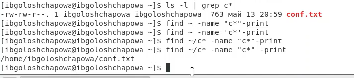{ #fig:001 width=70% }

5. Вывела на экран (по странично) имена файлов из каталога /etc, начинающиеся с символа h.

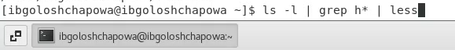{ #fig:001 width=70% }

{ #fig:001 width=70% }

6. Запустила в фоновом режиме процесс, который будет записывать в файл ~/logfile файлы, имена которых начинаются с log.

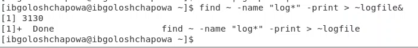{ #fig:001 width=70% }

7. Удалила файл ~/logfile.

{ #fig:001 width=70% }

8. Запустила из консоли в фоновом режиме редактор gedit.

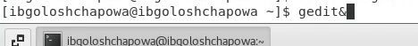{ #fig:001 width=70% }

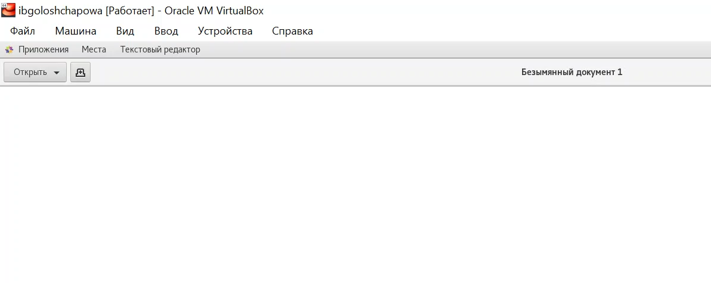{ #fig:001 width=70% }

9. Определила идентификатор процесса gedit, используя команду ps, конвейер и фильтр grep. 

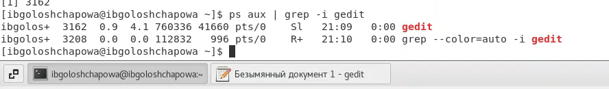{ #fig:001 width=70% }

10. Прочла справку (man) команды kill, после чего использовала её для завершения процесса gedit.

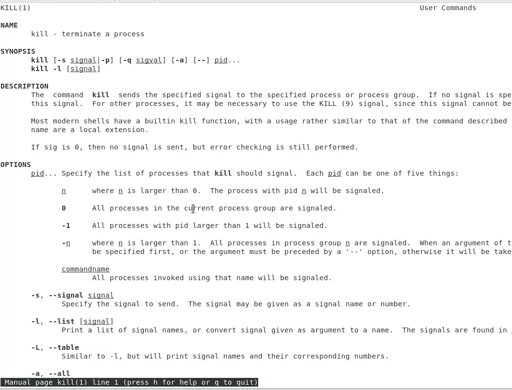{ #fig:001 width=70% }

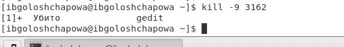{ #fig:001 width=70% }

11. Выполнила команды df и du, предварительно получив более подробную информацию об этих командах, с помощью команды man.

Справка о команде df:

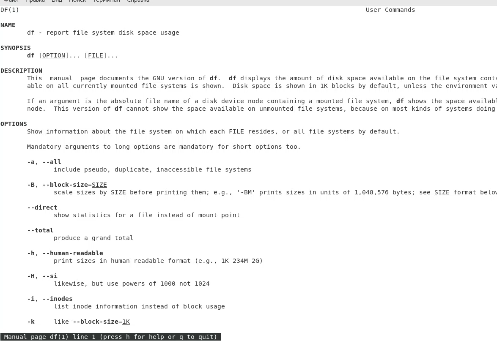{ #fig:001 width=70% }

Справка о команде du:

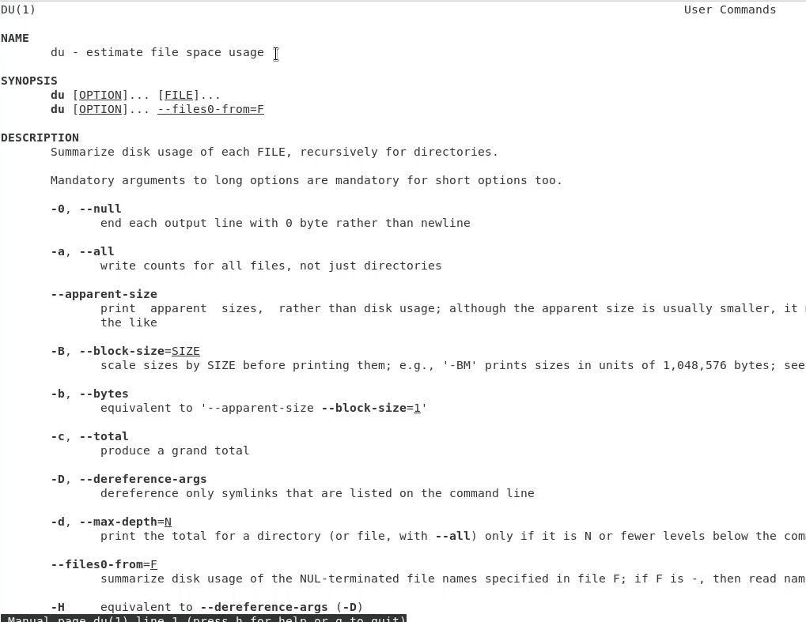{ #fig:001 width=70% }

Команда df:

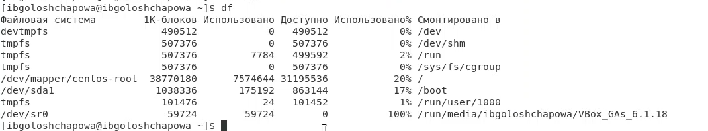{ #fig:001 width=70% }

Команда du:

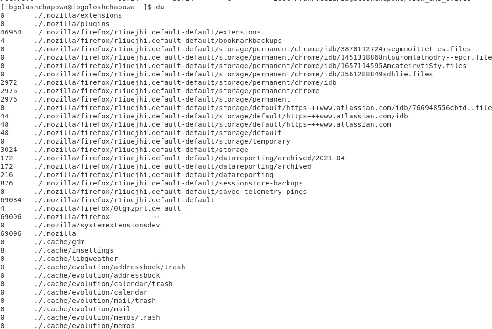{ #fig:001 width=70% }

12. Воспользовавшись справкой команды find, вывела имена всех директорий,
имеющихся в вашем домашнем каталоге

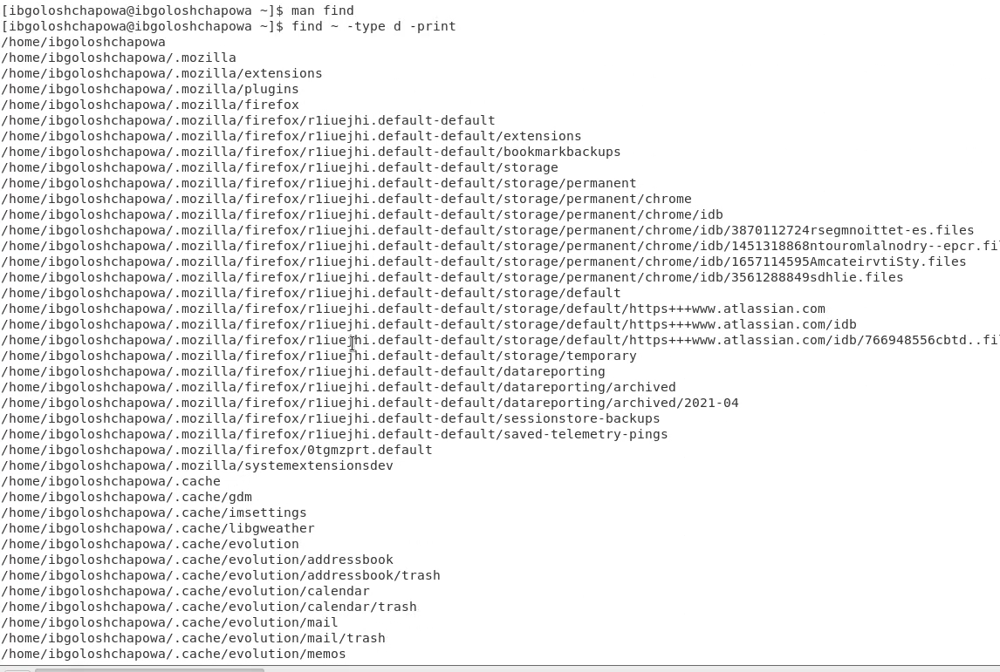{ #fig:001 width=70% }


# Выводы

В ходе лабораторной работы я ознакомилась с инструментами поиска файлов и фильтрации текстовых данных. Приобрела практические навыки: по управлению процессами (и заданиями), по проверке использования диска и обслуживанию файловых систем.


# Ответы на контрольные вопросы:

1. Какие потоки ввода вывода вы знаете?

> В системе по умолчанию открыто три специальных потока:

  – ```stdin```— стандартный поток ввода (по умолчанию: клавиатура), файловый дескриптор 0;

  – ```stdout``` — стандартный поток вывода (по умолчанию: консоль), файловый дескриптор 1;

  – ```stderr``` — стандартный поток вывод сообщений об ошибках (по умолчанию: консоль), файловый дескриптор 2.

2. Объясните разницу между операцией > и >>.

> ">" - перенаправление stdout (вывода) в файл. Если файл отсутствовал, то он создаётся, иначе - перезаписывается. 
> ">>" - перенаправление stdout (вывода) в файл. Если файл отсутствовал, то он создаётся, иначе - добавляется.


3. Что такое конвейер?
> Конвейер (pipe) служит для объединения простых команд или утилит в цепочки, в которых результат работы предыдущей команды передаётся последующей.

4. Что такое процесс? Чем это понятие отличается от программы?

> Процесс это - совокупность программного кода и данных, загруженных в память ЭВМ. Любой команде, выполняемой в системе, присваивается идентификатор процесса (process ID).Получить информацию о процессе и управлять им, пользуясь идентификатором процесса, можно из любого окна командного интерпретатора. Процессом называют выполняющуюся программу и все её элементы: адресное пространство, глобальные переменные, регистры, стек, открытые файлы и так далее.

5. Что такое PID и GID?

> ```PID``` — уникальный номер (идентификатор) процесса в многозадачной ОС. ```GID``` – идентификатор группы.

6. Что такое задачи и какая команда позволяет ими управлять?

> Любую выполняющуюся в консоли команду или внешнюю программу можно запустить в фоновом режиме. Запущенные фоном программы называются задачами (jobs). Ими можно управлять с помощью команды ```jobs```, которая выводит список запущенных в данный момент задач. Для завершения задачи необходимо выполнить команду ```kill %номер задачи```.

7. Найдите информацию об утилитах top и htop. Каковы их функции?

> Команда ```top``` в Linux системах позволяет вывести в виде таблицы перечень запущенных процессов и оценить, какой объем ресурсов они потребляют, т.е., какую нагрузку создают на сервер и дисковую подсистему.
> Команда ```htop``` — продвинутый монитор процессов, показывает динамический список системных процессов, список обычно выравнивается по использованию ЦПУ. В отличие от top, htop показывает все процессы в системе. Также показывает время непрерывной работы, использование процессоров и памяти. htop часто применяется в тех случаях, когда информации даваемой утилитой top недостаточно, например при поиске утечек памяти в процессах.

8. Назовите и дайте характеристику команде поиска файлов. Приведите примеры
использования этой команды.

> Команда find используется для поиска и отображения имён файлов, соответствующих заданной строке символов. Формат команды: find путь [-опции] Путь определяет каталог, начиная с которого по всем подкаталогам будет вестись поиск. Примеры:

- вывести на экран имена файлов из вашего домашнего каталога и его подкаталогов, начинающихся на f: ```find ~ -name "f*" -print```

- вывести на экран имена файлов в каталоге /etc, начинающихся с символа p: ```find /etc -name "p*" -print```

- найти в вашем домашнем каталоге файлы, имена которых заканчиваются символом и удалить их: ```find ~ -name "*~" -exec rm "{}" \```;

9. Можно ли по контексту (содержанию) найти файл? Если да, то как?

> Найти файл по контексту (содержанию) позволяет команда grep. Формат команды: ```grep строка имя_файла```
Примеры:

- показать строки во всех файлах в вашем домашнем каталоге с именами, начинающимися на f, в которых есть слово begin: ```grep begin f*```

- найти в текущем каталоге все файлы, в имени которых есть буквосочетание «лаб»: ```ls -l | grep лаб```


10. Как определить объем свободной памяти на жёстком диске?

> С помощью команды ```df```

11. Как определить объем вашего домашнего каталога?

> С помощью команды ```df /home/<user_name>```


12. Как удалить зависший процесс?

> С помощью команды ```kill %номер задачи```.
