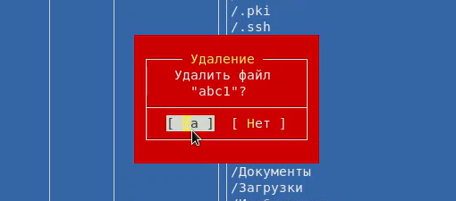

---
# Front matter
lang: ru-RU
title: "Лабораторная работа №8"
subtitle: "Командная оболочка Midnight Commander"
author: "Ирина Борисовна Голощапова"

# Formatting
toc-title: "Содержание"
toc: true # Table of contents
toc_depth: 2
lof: true # List of figures
lot: true # List of tables
fontsize: 12pt
linestretch: 1.5
papersize: a4paper
documentclass: scrreprt
polyglossia-lang: russian
polyglossia-otherlangs: english
mainfont: PT Serif
romanfont: PT Serif
sansfont: PT Sans
monofont: PT Mono
mainfontoptions: Ligatures=TeX
romanfontoptions: Ligatures=TeX
sansfontoptions: Ligatures=TeX,Scale=MatchLowercase
monofontoptions: Scale=MatchLowercase
indent: true
pdf-engine: lualatex
header-includes:
  - \linepenalty=10 # the penalty added to the badness of each line within a paragraph (no associated penalty node) Increasing the value makes tex try to have fewer lines in the paragraph.
  - \interlinepenalty=0 # value of the penalty (node) added after each line of a paragraph.
  - \hyphenpenalty=50 # the penalty for line breaking at an automatically inserted hyphen
  - \exhyphenpenalty=50 # the penalty for line breaking at an explicit hyphen
  - \binoppenalty=700 # the penalty for breaking a line at a binary operator
  - \relpenalty=500 # the penalty for breaking a line at a relation
  - \clubpenalty=150 # extra penalty for breaking after first line of a paragraph
  - \widowpenalty=150 # extra penalty for breaking before last line of a paragraph
  - \displaywidowpenalty=50 # extra penalty for breaking before last line before a display math
  - \brokenpenalty=100 # extra penalty for page breaking after a hyphenated line
  - \predisplaypenalty=10000 # penalty for breaking before a display
  - \postdisplaypenalty=0 # penalty for breaking after a display
  - \floatingpenalty = 20000 # penalty for splitting an insertion (can only be split footnote in standard LaTeX)
  - \raggedbottom # or \flushbottom
  - \usepackage{float} # keep figures where there are in the text
  - \floatplacement{figure}{H} # keep figures where there are in the text
---

# Цель работы

Освоение основных возможностей командной оболочки Midnight Commander.
Приобретение навыков практической работы по просмотру каталогов и файлов; манипуляций с ними.


# Задание

Научиться работать в командной оболочке Midnight Commander.
Приобрести навыки работы во встроенном редакторе mc.

________
# Выполнение лабораторной работы
## Задания по mc:

1. Изучила информацию о mc, вызвав в командной строке man mc.

{ #fig:001 width=70% }

2. Запустила из командной строки mc, изучила его структуру и меню.

{ #fig:001 width=70% }

3. Выполнила несколько операций в mc, используя управляющие клавиши
(операции с панелями; выделение/отмена выделения файлов, копирование/перемещение файлов, получение информации о размере и правах доступа
на файлы и/или каталоги и т.п.)

Операции с панелями:

{ #fig:001 width=70% }

Права доступа:

{ #fig:001 width=70% }

Копирование:

{ #fig:001 width=70% }

Удаление:

{ #fig:001 width=70% }

Перемещение:

{ #fig:001 width=70% }

Размер файлов и каталогов:

{ #fig:001 width=70% }

4. Выполнила основные команды меню левой (или правой) панели. Информация о файлах выводится довольно подробно.

Меню панели:

{ #fig:001 width=70% }

Информация о файле:

{ #fig:001 width=70% }

Дерево:

{ #fig:001 width=70% }

Формат списка файлов:

{ #fig:001 width=70% }


5. Используя возможности подменю ```Файл``` , выполнила:

– просмотр содержимого текстового файла;

{ #fig:001 width=70% }

– редактирование содержимого текстового файла (без сохранения результатов
редактирования);

{ #fig:001 width=70% }

– создание каталога;

{ #fig:001 width=70% }

– копирование в файлов в созданный каталог:

{ #fig:001 width=70% }

6. С помощью соответствующих средств подменю ```Команда``` осуществила:
– поиск в файловой системе файла с заданными условиями (например, файла
с расширением .c или .cpp, содержащего строку main);

{ #fig:001 width=70% }

{ #fig:001 width=70% }

– выбор и повторение одной из предыдущих команд;

{ #fig:001 width=70% }

– переход в домашний каталог;

{ #fig:001 width=70% }

– анализ файла меню и файла расширений.

Файл расширений:

{ #fig:001 width=70% }

Файл меню:

{ #fig:001 width=70% }


7. Вызвала подменю ```Настройки``` . Освоила операции, определяющие структуру
экрана mc (Full screen, Double Width, Show Hidden Files и т.д.)ю

{ #fig:001 width=70% }

__________________
## Задания по встроенному редактору mc:

1. Создала текстовой файл text.txt.

{ #fig:001 width=70% }

2. Открыла этот файл с помощью встроенного в mc редактора.

{ #fig:001 width=70% }

3. Вставила в открытый файл небольшой фрагмент текста.

{ #fig:001 width=70% }

4. Проделала с текстом следующие манипуляции, используя горячие клавиши:
4.1. Удалила строку текста при помощи клавиш ```Ctrl+y```

{ #fig:001 width=70% }

4.2. Выделила фрагмент текста и скопировала его на новую строку (```F5```).

{ #fig:001 width=70% }

4.3. Выделила фрагмент текста и перенесла его на новую строку(```F6```).

{ #fig:001 width=70% }

4.4. Сохранила файл.

{ #fig:001 width=70% }

4.5. Отменила последнее действие с помощье сочетания клавиш ```Ctrl+u```

4.6. Перейшла в конец файла (нажав комбинацию клавиш ```Ctrl+x```) и написала некоторый текст.

{ #fig:001 width=70% }

4.7. Перейшла в начало файла (нажав комбинацию клавиш ```Ctrl+z```) и написала некоторый текст.

{ #fig:001 width=70% }

4.8. Сохранила и закрыла файл при помощи клавиши ```F10```.

5. Открыла файл с исходным текстом на некотором языке программирования (на языке С++)

{ #fig:001 width=70% }

6. Используя меню редактора, выключила подсветку синтаксиса (сочетание ```Ctrl+s```).

{ #fig:001 width=70% }


# Выводы

В ходе лабораторной работы я освоила основные возможности командной оболочки Midnight Commander.
Приобрела навыкы практической работы по просмотру каталогов и файлов; манипуляций с ними.

