---
# Front matter
lang: ru-RU
title: "Отчёт по лабораторной работе №9"
subtitle: "Текстовой редактор vi"
author: "Голощапова Ирина Борисовна"

# Formatting
toc-title: "Содержание"
toc: true # Table of contents
toc_depth: 2
lof: true # List of figures
lot: true # List of tables
fontsize: 12pt
linestretch: 1.5
papersize: a4paper
documentclass: scrreprt
polyglossia-lang: russian
polyglossia-otherlangs: english
mainfont: PT Serif
romanfont: PT Serif
sansfont: PT Sans
monofont: PT Mono
mainfontoptions: Ligatures=TeX
romanfontoptions: Ligatures=TeX
sansfontoptions: Ligatures=TeX,Scale=MatchLowercase
monofontoptions: Scale=MatchLowercase
indent: true
pdf-engine: lualatex
header-includes:
  - \linepenalty=10 # the penalty added to the badness of each line within a paragraph (no associated penalty node) Increasing the value makes tex try to have fewer lines in the paragraph.
  - \interlinepenalty=0 # value of the penalty (node) added after each line of a paragraph.
  - \hyphenpenalty=50 # the penalty for line breaking at an automatically inserted hyphen
  - \exhyphenpenalty=50 # the penalty for line breaking at an explicit hyphen
  - \binoppenalty=700 # the penalty for breaking a line at a binary operator
  - \relpenalty=500 # the penalty for breaking a line at a relation
  - \clubpenalty=150 # extra penalty for breaking after first line of a paragraph
  - \widowpenalty=150 # extra penalty for breaking before last line of a paragraph
  - \displaywidowpenalty=50 # extra penalty for breaking before last line before a display math
  - \brokenpenalty=100 # extra penalty for page breaking after a hyphenated line
  - \predisplaypenalty=10000 # penalty for breaking before a display
  - \postdisplaypenalty=0 # penalty for breaking after a display
  - \floatingpenalty = 20000 # penalty for splitting an insertion (can only be split footnote in standard LaTeX)
  - \raggedbottom # or \flushbottom
  - \usepackage{float} # keep figures where there are in the text
  - \floatplacement{figure}{H} # keep figures where there are in the text
---

# Цель работы

Ознакомиться с операционной системой Linux. Получить практические навыки работы с редактором vi, установленным по умолчанию практически во всех дистрибутивах


# Библиография
[Работа в редакторе vi. Особенности использования](https://docs.altlinux.org/ru-RU/archive/2.3/html-single/junior/alt-docs-extras-linuxnovice/ch02s10.html)


[Vi - Википедия](https://ru.wikipedia.org/wiki/Vi)


[Полная справка по редактору vi](https://remoteshaman.com/unix/common/polnaya-reference-at-vi-redaktoru)


# Выполнение лабораторной работы


 ### Задание 1. "Создание нового файла с использованием vi"

1. Создала каталог с именем ~/work/os/lab09.

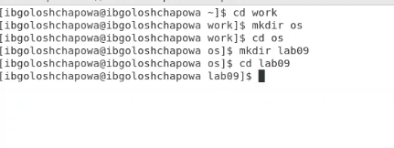{ #fig:001 width=70% } 

***Рис.1 "каталог lab09"*** 

2. Перешла во вновь созданный каталог, вызвала редактор vi и создала файл hello.sh
```vi hello.sh```

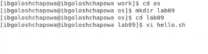{ #fig:001 width=70% }

***Рис.2 "файл hello.sh"***

3. Нажала клавишу i и ввела следующий текст.
```#!/bin/bash
HELL=Hello
function hello {
LOCAL HELLO=World
echo $HELLO
}
echo $HELLO
hello
```

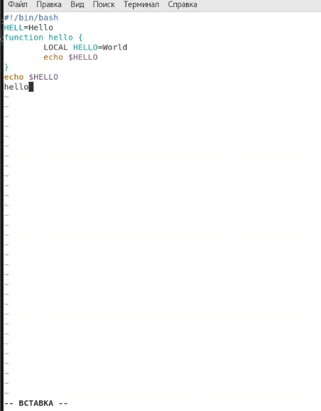{ #fig:001 width=70% }

***Рис.3 "редактирование файла hello.sh"***

5. Нажала клавишу ```Esc``` (для перехода в командный режим после завершения ввода
текста). Нажала ```:``` для перехода в режим последней строки и внизу экрана
появилось приглашение в виде двоеточия. Нажала ```w``` (записать) и ```q``` (выйти), а затем клавишу ```Enter``` для сохранения текста и завершения работы.


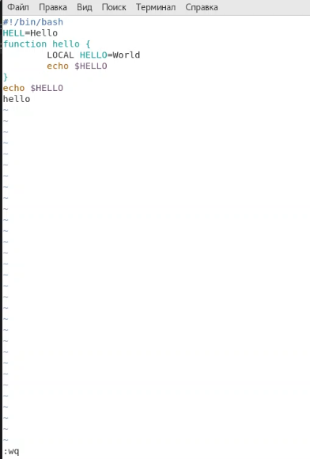{ #fig:001 width=70% }

***Рис.4 "сохранение и выход из файла hello.sh"***

8. Сделала файл исполняемым

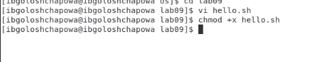{ #fig:001 width=70% }

***Рис.5 "исполняемый файл hello.sh"***

### Задание 2. "Редактирование существующего файла"
1. Вызвала vi на редактирование файла
```vi ~/work/os/lab06/hello.sh```

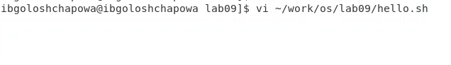{ #fig:001 width=70% }

***Рис.6 "вызов файла hello.sh на редактирование"***


2. Установила курсор в конец слова HELL второй строки.

{ #fig:001 width=70% }

***Рис.7 "курсор в начале слова HELL"***

3. Перешла в режим вставки и заменила на HELLO. Нажала Esc для возврата в
командный режим.

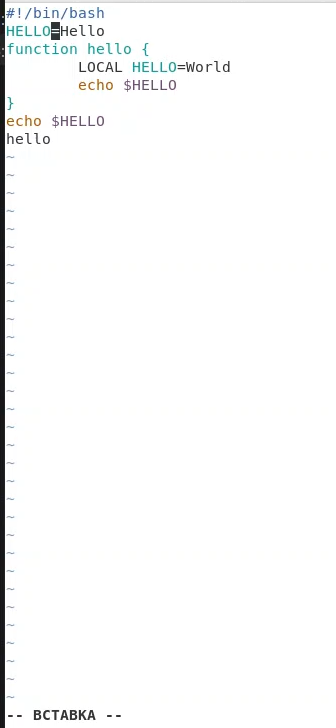{ #fig:001 width=70% }

***Рис.8 "замена HELL на HELLO"***

4. Установила курсор на четвертую строку и стерла слово LOCAL.

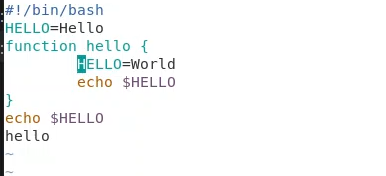{ #fig:001 width=70% }

***Рис.9 "удаление слова LOCAL"***

5. Перешла в режим вставки и набрала следующий текст: ```local```, нажала ```Esc```
для возврата в командный режим.

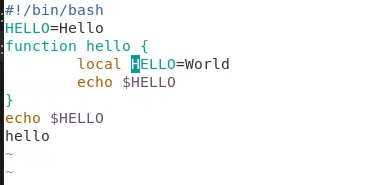{ #fig:001 width=70% }

***Рис.10 "ввод local"***

6. Установила курсор на последней строке файла. Вставила после неё строку, содержащую следующий текст: ```echo $HELLO```.

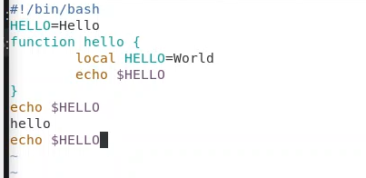{ #fig:001 width=70% }

***Рис.11 "echo $HELLO"***

7. Нажала ```Esc``` для перехода в командный режим. Удалила последнюю строку.

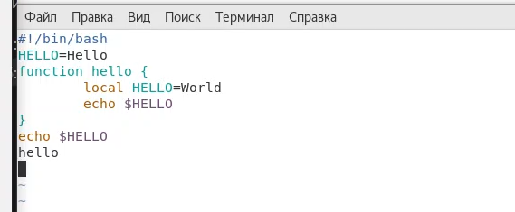{ #fig:001 width=70% }

***Рис.12 "удаление последнем строки"***

9. Ввела команду отмены изменений ```u``` для отмены последней команды.

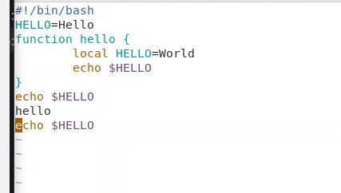{ #fig:001 width=70% }

***Рис.13 "отмена последних изменений"***

10. Ввела символ ```:``` для перехода в режим последней строки. Записала произведённые изменения и выйдите из vi.

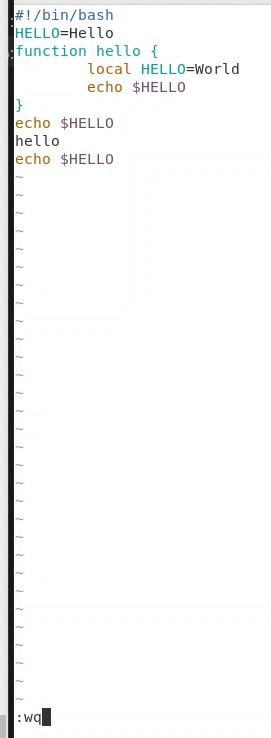{ #fig:001 width=70% }

***Рис.14 "сохранение и выход из редактора vi"***


# Выводы

В ходе лабораторной работы я ознакомилась с операционной системой Linux. Получила практические навыки работы с редактором vi, установленным по умолчанию практически во всех дистрибутивах.


# Контрольные вопросы
> 1.Краткая характеристика режимов работы редактора vi:

– *командный режим* — предназначен для ввода команд редактирования и навигации по редактируемому файлу;

– *режим вставки* — предназначен для ввода содержания редактируемого файла;

– *режим последней* (или командной) строки — используется для записи изменений в файл и выхода из редактора.

> 2. Выйти из редактора, не сохраняя произведённые изменения, можно используя клавиши ```:q!``` в командном режиме.

> 3. Краткую характеристика команд позиционирования:

– ```0``` (ноль) — переход в начало строки;

– ```$``` — переход в конец строки;

– ```G``` — переход в конец файла;

– ```n G``` — переход на строку с номером n.

> 4. Для редактора vi словом является: пробел; буквы, находящиеся между двумя пробелами.

> 5. Из любого места редактируемого файла перейти в конец файла можно с помощью клавишы G и курсора вниз, а в начало – курсор вверх.

> 6. Краткая характеристика основных групп команд редактирования:

***Вставка текста***

– ```а``` — вставить текст после курсора;

– ```А``` — вставить текст в конец строки;

– ```i``` — вставить текст перед курсором;

– ```n i``` — вставить текст n раз;

– ```I``` — вставить текст в начало строки.

***Вставка строки***

– ```о``` — вставить строку под курсором;

– ```О``` — вставить строку над курсором. Удаление текста

– ```x``` — удалить один символ в буфер;

– ```d w``` — удалить одно слово в буфер;

– ```d $``` — удалить в буфер текст от курсора до конца строки;

– ```d 0``` — удалить в буфер текст от начала строки до позиции курсора;

– ```d d``` — удалить в буфер одну строку;

– ```n d d``` — удалить в буфер n строк. Отмена и повтор произведённых изменений

– ```u``` — отменить последнее изменение;

– ```.``` — повторить последнее изменение.

***Копирование текста в буфер***

– ```Y``` — скопировать строку в буфер;

– ```n Y``` — скопировать n строк в буфер;

– ```y w``` — скопировать слово в буфер.

***Вставка текста из буфера***

– ```p``` — вставить текст из буфера после курсора;

– ```P``` — вставить текст из буфера перед курсором. Замена текста

– ```c w``` — заменить слово;

– ```n c w``` — заменить n слов;

– ```c $``` — заменить текст от курсора до конца строки;

– ```r``` — заменить слово;

– ```R``` — заменить текст.

***Поиск текста***

– ```/ текст``` — произвести поиск вперёд по тексту указанной строки символов текст;

– ```? текст``` — произвести поиск назад по тексту указанной строки символов текст. 

> 7. Чтобы заполнить строку символами $ можно использовать клавиши ni(вставить текст n раз).

> 8. Отменить некорректное действие, связанное с процессом редактирования, можно с помощью клавиши «.».

> 9. Характеристика основных групп команд режима последней строки:

***Копирование и перемещение текста***

– : n,m d — удалить строки с n по m;

– : i,j m k — переместить строки с i по j, начиная со строки k;

– : i,j t k — копировать строки с i по j в строку k;

– : i,j w имя-файла — записать строки с i по j в файл с именем имя-файла.

***Запись в файл и выход из редактора***

– : w — записать изменённый текст в файл, не выходя из vi;

– : w имя-файла — записать изменённый текст в новый файл с именем имяфайла;

– : w ! имя-файла — записать изменённый текст в файл с именем имяфайла;

– : w q — записать изменения в файл и выйти из vi;

– : q — выйти из редактора vi;

– : q ! — выйти из редактора без записи;

– : e ! — вернуться в командный режим, отменив все изменения, произведённые со времени последней записи.

> 10. Определить, не перемещая курсора, позицию, в которой заканчивается строка, можно используя клавишу $ (переход в конец строки).

> 11. Опции редактора vi позволяют настроить рабочую среду. Для задания опций используется команда ```set``` (в режиме последней строки):

– : set all — вывести полный список опций;

– : set nu — вывести номера строк;

– : set list — вывести невидимые символы;

– : set ic — не учитывать при поиске, является ли символ прописным или строчным.

Если вы хотите отказаться от использования опции, то в команде set перед именем опции надо поставить no.

> 12. Определить режим работы редактора vi можно по последней командной строке.


