---
# Front matter
lang: ru-RU
title: "Отчёт по лабораторной работе №10"
subtitle: "Текстовой редактор emacs"
author: "Голощапова Ирина Борисовна"

# Formatting
toc-title: "Содержание"
toc: true # Table of contents
toc_depth: 2
lof: true # List of figures
lot: true # List of tables
fontsize: 12pt
linestretch: 1.5
papersize: a4paper
documentclass: scrreprt
polyglossia-lang: russian
polyglossia-otherlangs: english
mainfont: PT Serif
romanfont: PT Serif
sansfont: PT Sans
monofont: PT Mono
mainfontoptions: Ligatures=TeX
romanfontoptions: Ligatures=TeX
sansfontoptions: Ligatures=TeX,Scale=MatchLowercase
monofontoptions: Scale=MatchLowercase
indent: true
pdf-engine: lualatex
header-includes:
  - \linepenalty=10 # the penalty added to the badness of each line within a paragraph (no associated penalty node) Increasing the value makes tex try to have fewer lines in the paragraph.
  - \interlinepenalty=0 # value of the penalty (node) added after each line of a paragraph.
  - \hyphenpenalty=50 # the penalty for line breaking at an automatically inserted hyphen
  - \exhyphenpenalty=50 # the penalty for line breaking at an explicit hyphen
  - \binoppenalty=700 # the penalty for breaking a line at a binary operator
  - \relpenalty=500 # the penalty for breaking a line at a relation
  - \clubpenalty=150 # extra penalty for breaking after first line of a paragraph
  - \widowpenalty=150 # extra penalty for breaking before last line of a paragraph
  - \displaywidowpenalty=50 # extra penalty for breaking before last line before a display math
  - \brokenpenalty=100 # extra penalty for page breaking after a hyphenated line
  - \predisplaypenalty=10000 # penalty for breaking before a display
  - \postdisplaypenalty=0 # penalty for breaking after a display
  - \floatingpenalty = 20000 # penalty for splitting an insertion (can only be split footnote in standard LaTeX)
  - \raggedbottom # or \flushbottom
  - \usepackage{float} # keep figures where there are in the text
  - \floatplacement{figure}{H} # keep figures where there are in the text
---

# Цель работы

Ознакомиться с операционной системой Linux. Получить практические навыки работы с редактором Emacs.

# Библиография
[Изучаем основы emacs](https://aixportal.ru/emacs/#:~:text=Овладейте%20редактором%20Emacs%20и%20погрузитесь,в%20качестве%20полноценной%20среды%20разработки)


[EMACS - Википедия](https://ru.wikipedia.org/wiki/Emacs)


[Полная справка по редактору EMACS](https://pythonist-ru.turbopages.org/pythonist.ru/s/tekstovyj-redaktor-emacs/)


# Выполнение лабораторной работы


1. Открыла emacs.

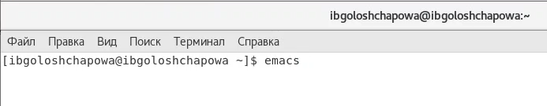{ #fig:001 width=70% } 

***Рис.1 "emacs"*** 


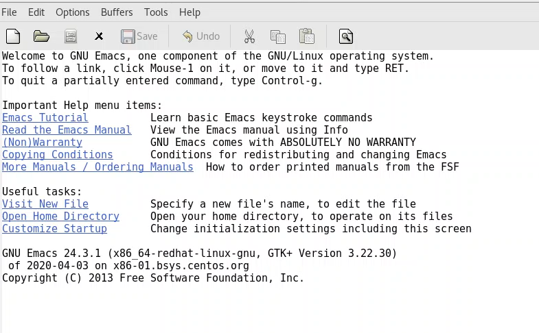{ #fig:001 width=70% } 

***Рис.2 "emacs"*** 

2. Создала файл lab10.sh с помощью комбинации Ctrl-x Ctrl-f (C-x C-f).

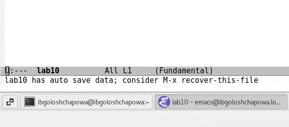{ #fig:001 width=70% } 

***Рис.3 "файл lab10.sh"*** 


3. Набрала текст в файл и схранила с помощью комбинации Ctrl-x Ctrl-s (C-x C-s)

```#!/bin/bash
HELL=Hello
function hello {50 Лабораторная работа № 7. Текстовой редактор emacs
LOCAL HELLO=World
echo $HELLO
}
echo $HELLO
hello
```

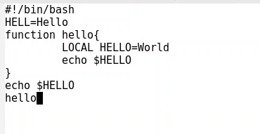{ #fig:001 width=70% } 

***Рис.4 "набор текста в файле lab10.sh"*** 


5. Проделала с текстом стандартные процедуры редактирования, каждое действие осуществила с помощью комбинаций клавиш.
5.1. Вырезала одной командой целую строку (С-k).

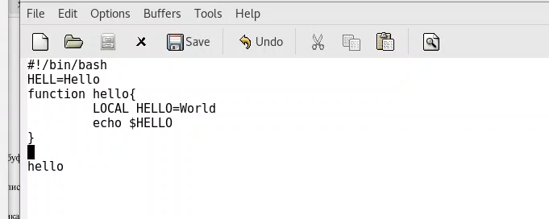{ #fig:001 width=70% } 

***Рис.5 "вырезать строку"*** 

5.2. Вставила эту строку в конец файла (C-y).

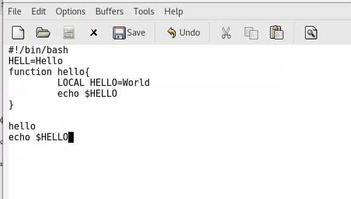{ #fig:001 width=70% } 

***Рис.6 "вставка строки"*** 

5.3. Выделила область текста (C-space).

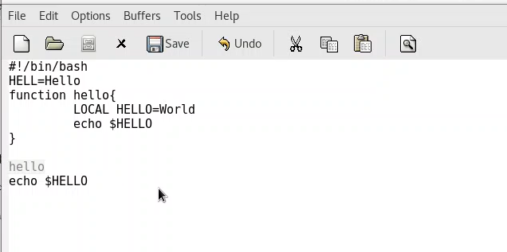{ #fig:001 width=70% } 

***Рис.7 "выделение области"*** 

5.4. Скопировать область в буфер обмена (M-w) и вставила область в конец файла.

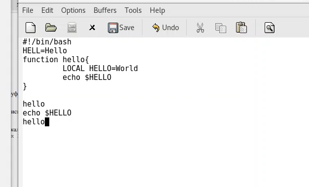{ #fig:001 width=70% } 

***Рис.8 "копирование и вставка"*** 

5.6. Вновь выделила эту область и на этот раз вырезала её (C-w).

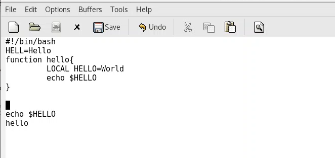{ #fig:001 width=70% } 

***Рис.9 "выделение и вставка"*** 

5.7. Отмените последнее действие (C-/).

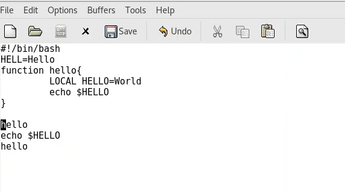{ #fig:001 width=70% } 

***Рис.10 "отмена дейтсвия"*** 

6. Научилась использовать команды по перемещению курсора.

6.1. Переместила курсор в начало строки (C-a).

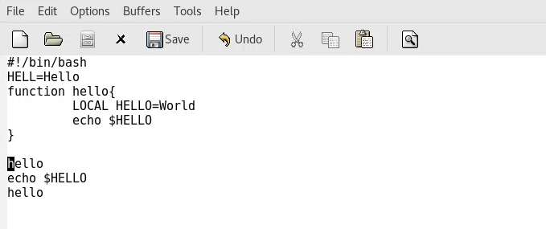{ #fig:001 width=70% } 

***Рис.11 "курсор в начале строки"*** 

6.2. Переместила курсор в конец строки (C-e).

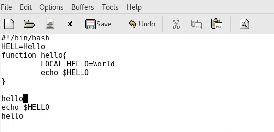{ #fig:001 width=70% } 

***Рис.12 "курсор в конце строки"*** 

6.3. Переместила курсор в начало буфера (M-<).

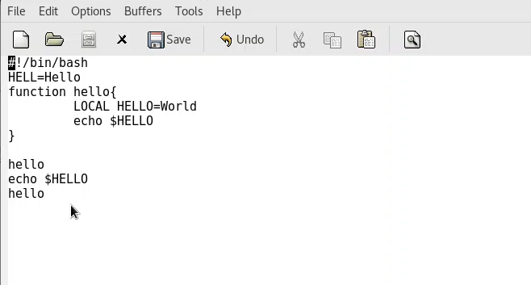{ #fig:001 width=70% } 

***Рис.13 "курсор в начале буфера"*** 

6.4. Переместите курсор в конец буфера (M->).

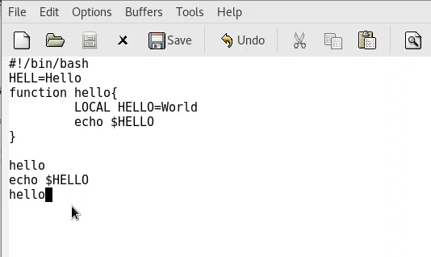{ #fig:001 width=70% } 

***Рис.14 "курсор в конце буфера"*** 

7. Управление буферами.

7.1. Вывела список активных буферов на экран (C-x C-b).

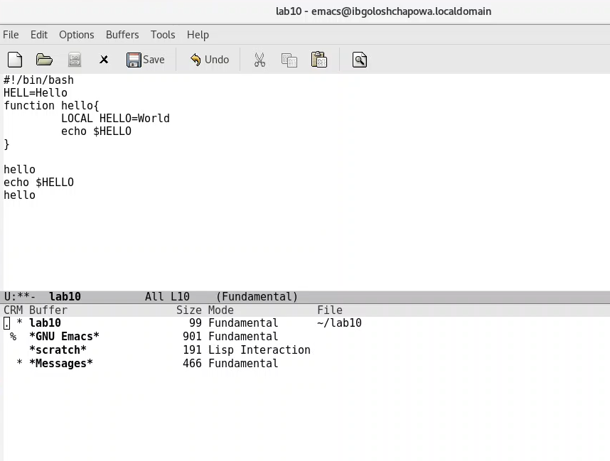{ #fig:001 width=70% } 

***Рис.15 "список буфера"*** 

7.2. Переместилась во вновь открытое окно (C-x) o со списком открытых буферов и переключилась на другой буфер.

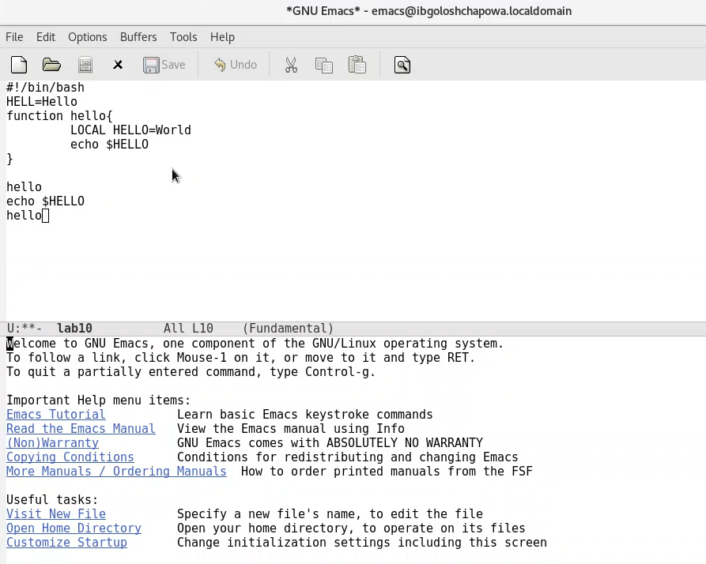{ #fig:001 width=70% } 

***Рис.16 "переход в другой буфер"*** 

7.3. Закрыла это окно (C-x 0).

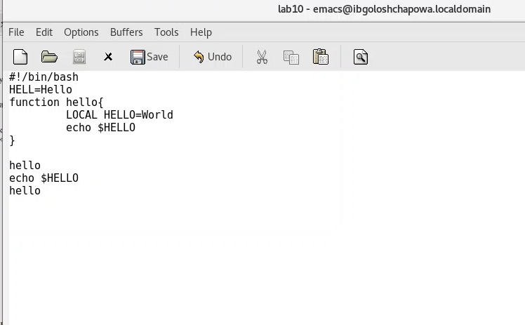{ #fig:001 width=70% } 

***Рис.17 "закрытие окна"*** 

7.4. Теперь вновь переключилась между буферами, но уже без вывода их списка
на экран (C-x b).

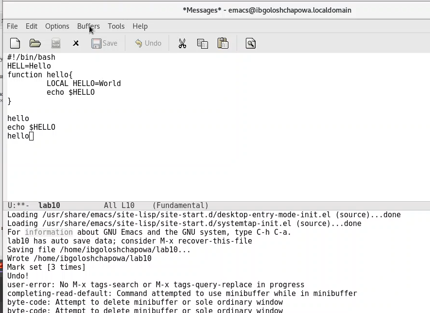{ #fig:001 width=70% } 

***Рис.18 "переключение между буферами"*** 

8. Управление окнами.
8.1. Поделила фрейм на 4 части: разделила фрейм на два окна по вертикали
(C-x 3), а затем каждое из этих окон на две части по горизонтали (C-x 2)

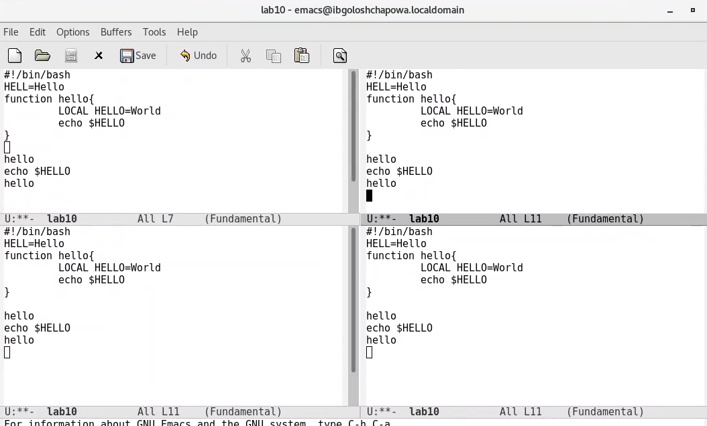{ #fig:001 width=70% } 

***Рис.19 "разделение фрейма"*** 

8.2. В каждом из четырёх созданных окон открыла новый буфер (файл) и ввела несколько строк текста.

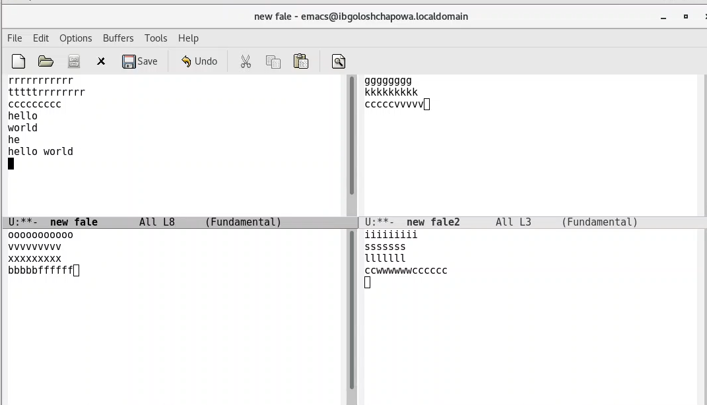{ #fig:001 width=70% } 

***Рис.20 "ввод строк текста"*** 

9. Режим поиска
9.1. Переключилась в режим поиска (C-s) и нашла несколько слов, присутствующих в тексте.

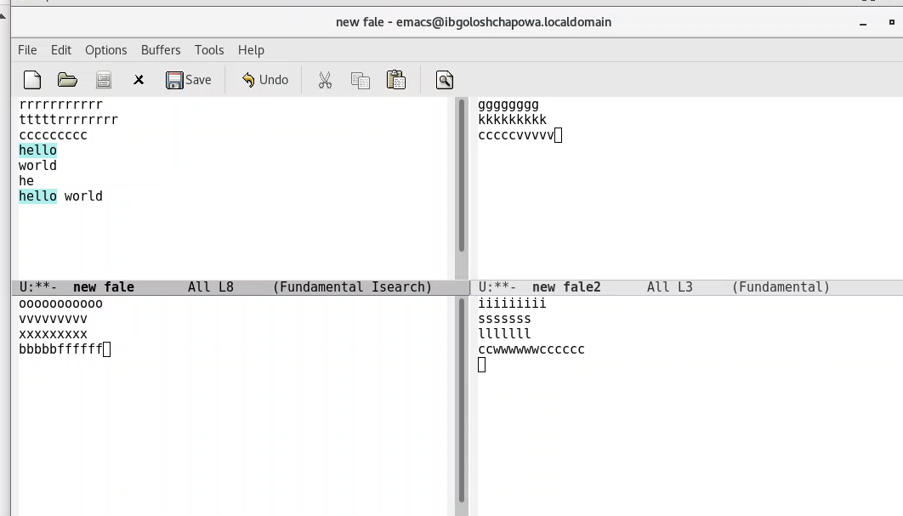{ #fig:001 width=70% } 

***Рис.21 "режим поиска"*** 

9.2. Переключтлась между результатами поиска, нажимая C-s.

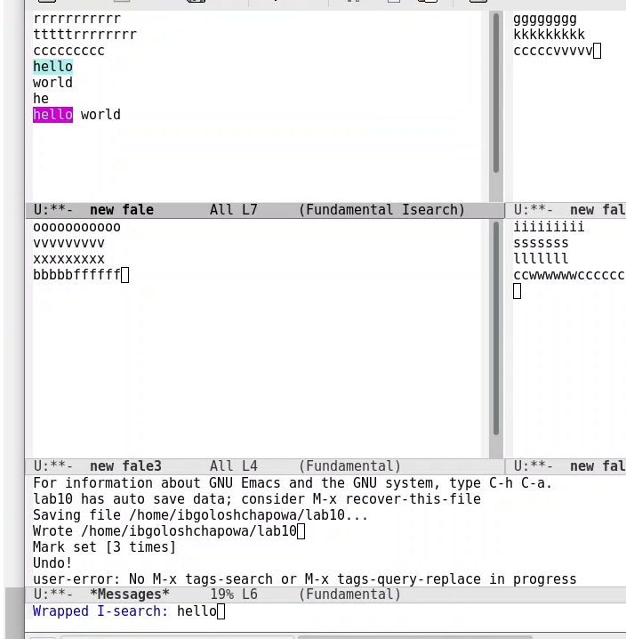{ #fig:001 width=70% } 

***Рис.22 "переключение между результатами поиска"*** 

9.3. Вышла из режима поиска, нажав C-g.

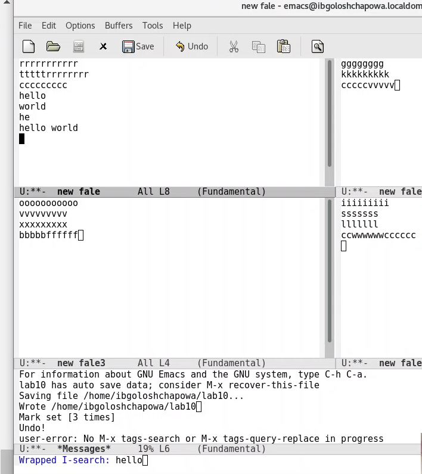{ #fig:001 width=70% } 

***Рис.23 "выход из режима поиска"*** 

9.4. Перешла в режим поиска и замены (M-%), ввела текст, который следует
найти и заменить, нажала Enter , затем ввела текст для замены. После того как результаты поиска стали подствечены, нажала ! для подтверждения замены.

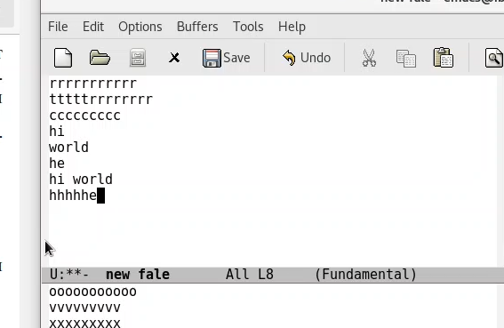{ #fig:001 width=70% } 

***Рис.24 "режим поиска и замены"*** 

9.5. Испробовала другой режим поиска, нажав M-s o. Он отличается от обычного режима тем, что при поиске указывает номера строк, в которых найдено введенное слово и выделяет их цветом. В обычном режиме выделение цветом появляется, только когда нужно подтвердить замену

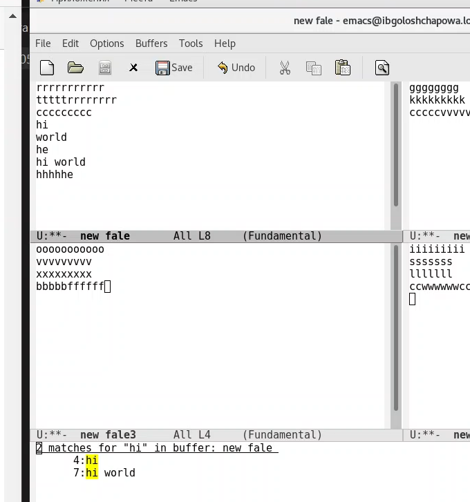{ #fig:001 width=70% } 

***Рис.25 "другой режим поиска и замены"*** 


# Выводы

В ходе лабораторной работы я ознакомилась с операционной системой Linux. Получила практические навыки работы с редактором Emacs.


# Контрольные вопросы

> 1. Emacs представляет собой мощный экранный редактор текста, написанный на языке высокого уровня Elisp.

> 2. Развитие Emacs в сторону его многогранности послужило причиной того, что и без того интуитивно непонятная программа стала чрезвычайно сложной в применении. В частности, управление осуществляется при помощи различных клавиатурных комбинаций, запомнить которые будет непросто.

> 3. Буфер – что-то, состоящее из текста. Окно – область с одним из буферов.

> 4. В одном окне можно открыть больше 10 буферов.

> 5. После запуска emacs без каких-либо параметров в основном окне отображается буфер *scratch*, который используется для оценки выражений Emacs Lisp, а также для заметок, которые вы не хотите сохранять. Этот буфер не сохраняется автоматически.

> 6. Чтобы ввести следующую комбинацию C-c | я нажму клавиши: Control+c и Shift+\, и для C-c C-|: Control+c и Control+Shift+\.

> 7. Поделить текущее окно на две части можно двумя комбинациями клавиш: ```C-x 3 или C-x 2```.

> 8. Настроить или расширить Emacs можно написав или изменив файл ~/.emacs.

> 9. Клавиша ```ß``` выполняет функцию перемещения курсора в открытом окне также, как и многие другие клавиши её можно переназначить.

> 10. Редактор emacs для меня наиболее удобный из-за возможности открытия нескольких окон с буферами и работы комбинациями клавиш.
