---
# Front matter
lang: ru-RU
title: "Отчёт по лабораторной работе №11"
subtitle: "Программирование в командном процессоре ОС UNIX. Командные файлы"
author: "Голощапова Ирина Борисовна"

# Formatting
toc-title: "Содержание"
toc: true # Table of contents
toc_depth: 2
lof: true # List of figures
lot: true # List of tables
fontsize: 12pt
linestretch: 1.5
papersize: a4paper
documentclass: scrreprt
polyglossia-lang: russian
polyglossia-otherlangs: english
mainfont: PT Serif
romanfont: PT Serif
sansfont: PT Sans
monofont: PT Mono
mainfontoptions: Ligatures=TeX
romanfontoptions: Ligatures=TeX
sansfontoptions: Ligatures=TeX,Scale=MatchLowercase
monofontoptions: Scale=MatchLowercase
indent: true
pdf-engine: lualatex
header-includes:
  - \linepenalty=10 # the penalty added to the badness of each line within a paragraph (no associated penalty node) Increasing the value makes tex try to have fewer lines in the paragraph.
  - \interlinepenalty=0 # value of the penalty (node) added after each line of a paragraph.
  - \hyphenpenalty=50 # the penalty for line breaking at an automatically inserted hyphen
  - \exhyphenpenalty=50 # the penalty for line breaking at an explicit hyphen
  - \binoppenalty=700 # the penalty for breaking a line at a binary operator
  - \relpenalty=500 # the penalty for breaking a line at a relation
  - \clubpenalty=150 # extra penalty for breaking after first line of a paragraph
  - \widowpenalty=150 # extra penalty for breaking before last line of a paragraph
  - \displaywidowpenalty=50 # extra penalty for breaking before last line before a display math
  - \brokenpenalty=100 # extra penalty for page breaking after a hyphenated line
  - \predisplaypenalty=10000 # penalty for breaking before a display
  - \postdisplaypenalty=0 # penalty for breaking after a display
  - \floatingpenalty = 20000 # penalty for splitting an insertion (can only be split footnote in standard LaTeX)
  - \raggedbottom # or \flushbottom
  - \usepackage{float} # keep figures where there are in the text
  - \floatplacement{figure}{H} # keep figures where there are in the text
---

# Цель работы

Изучить основы программирования в оболочке ОС UNIX/Linux. Научиться писать небольшие командные файлы.

# Библиография
[Изучаем основы emacs](https://aixportal.ru/emacs/#:~:text=Овладейте%20редактором%20Emacs%20и%20погрузитесь,в%20качестве%20полноценной%20среды%20разработки)

[EMACS - Википедия](https://ru.wikipedia.org/wiki/Emacs)

[Полная справка по редактору EMACS](https://pythonist-ru.turbopages.org/pythonist.ru/s/tekstovyj-redaktor-emacs/)

# Выполнение лабораторной работы

1. Написала скрипт, который при запуске будет делать резервную копию самого себя (то есть файла, в котором содержится его исходный код) в другую директорию
backup в моём домашнем каталоге. При этом файл должен архивироваться одним из архиваторов на выбор zip, bzip2 или tar. Способ использования команд
архивации узнала, изучив справку (команда man).

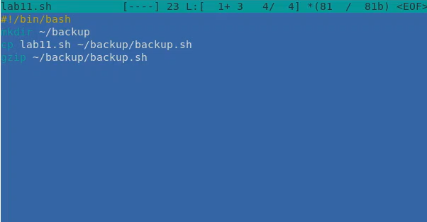

*Рис.1 "Скрипт программы"*

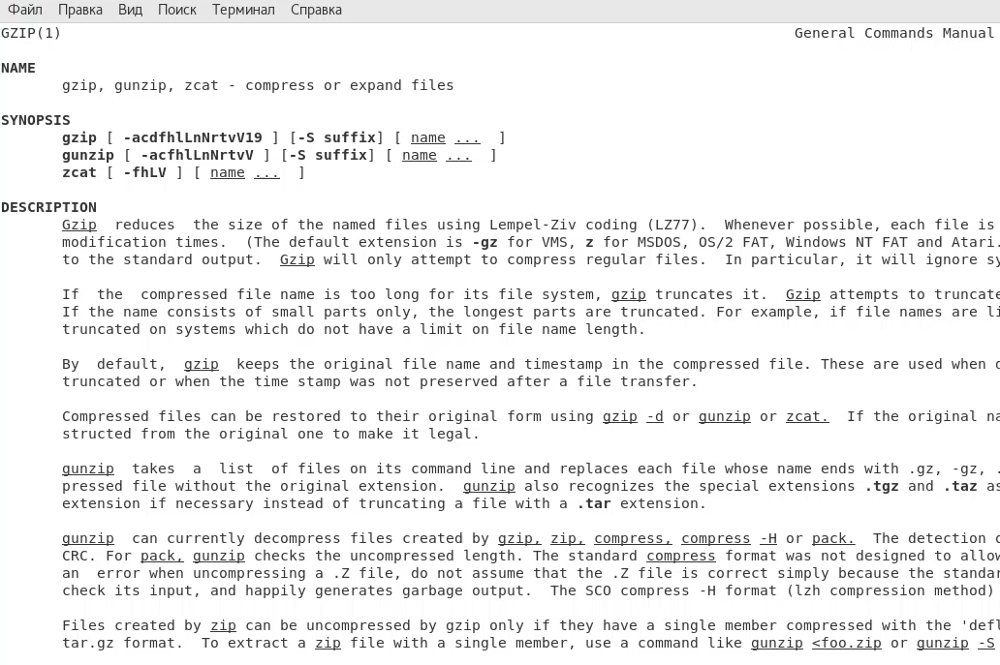

*Рис.2 "Справка об архиваторе"*

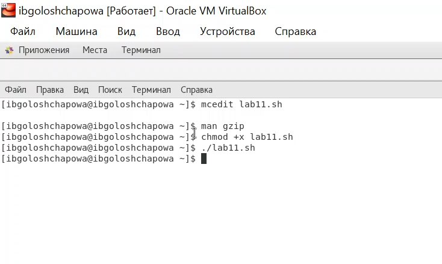

*Рис.3 "Командная строка"*

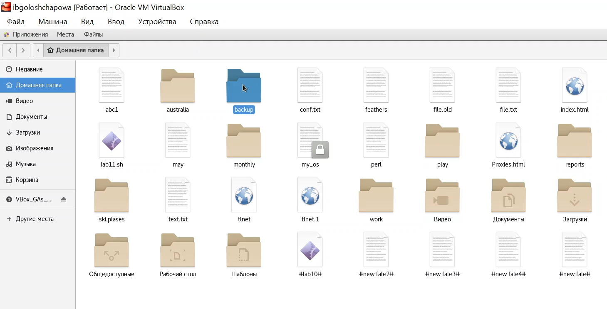

*Рис.4 "Домашняя папка"*

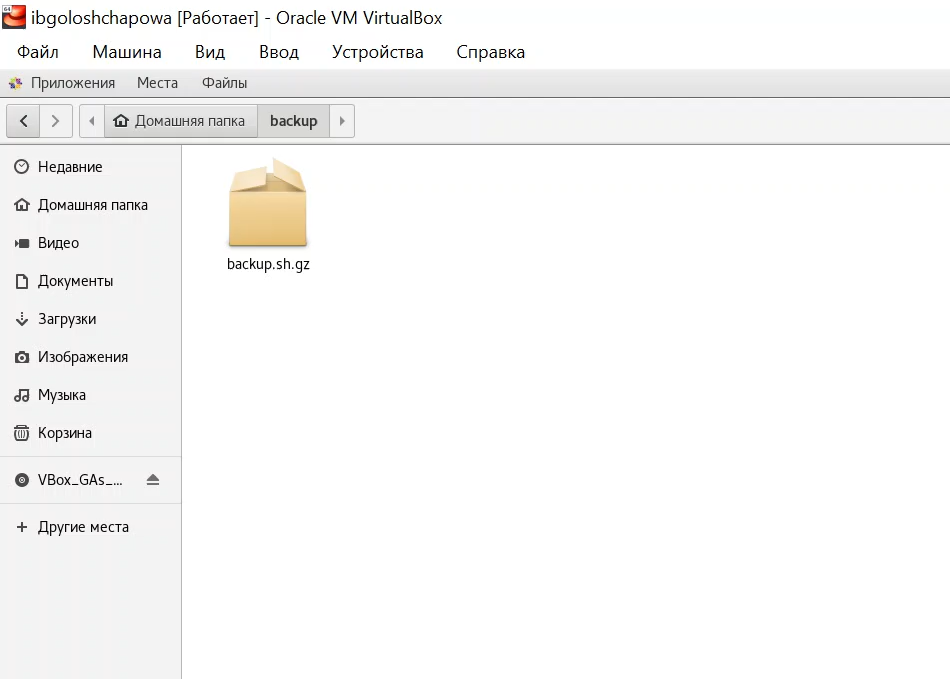 

*Рис.5 "backup"*

2. Написала пример командного файла, обрабатывающего любое произвольное
число аргументов командной строки, в том числе превышающее десять. Скрипт последовательно распечатывает значения всех переданных
аргументов.

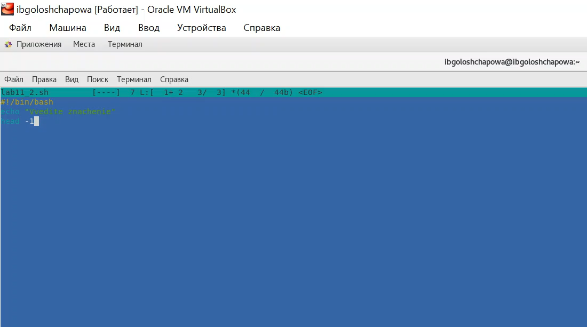 

*Рис.6 "Скрипт программы"*

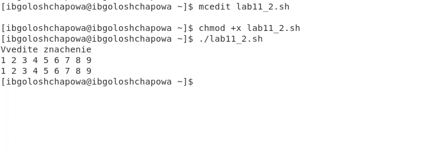 

*Рис.7 "Командная строка"*

3. Написала командный файл — аналог команды ls (без использования самой этой команды и команды dir). Требовалось, чтобы он выдавал информацию о нужном
каталоге и выводил информацию о возможностях доступа к файлам этого каталога.

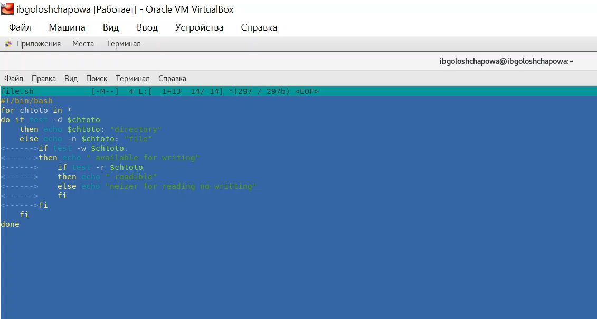 

*Рис.8 "Скрипт"*

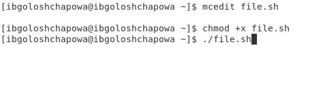 

*Рис.9 "Командная строка"*

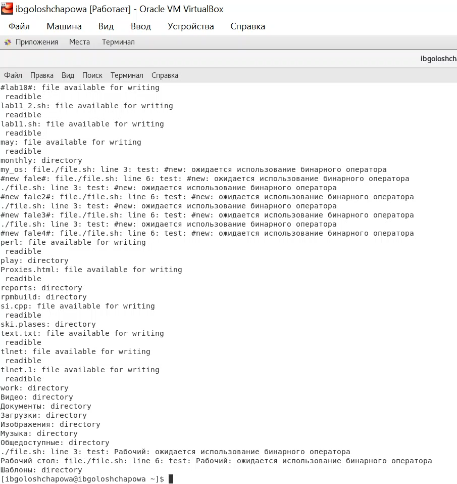 

*Рис.10 "Работа программы"*

4. Написать командный файл, который получает в качестве аргумента командной
строки формат файла (.txt, .doc, .jpg, .pdf и т.д.) и вычисляет количество
таких файлов в указанной директории. Путь к директории также передаётся в
виде аргумента командной строки.

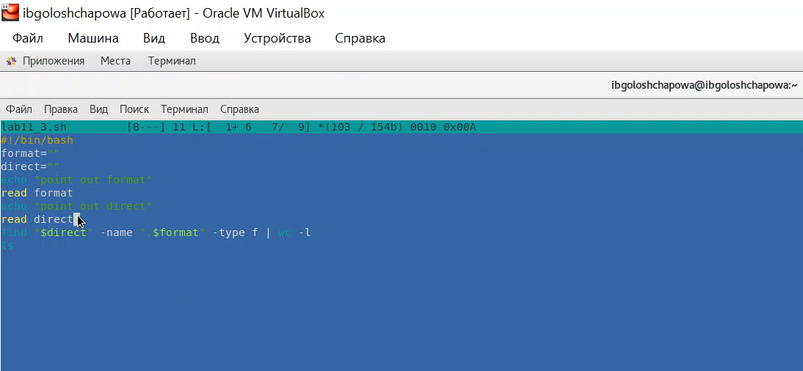 

*Рис.11 "Скрипт 4"*

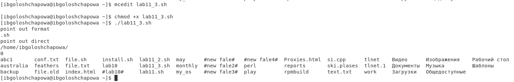 

*Рис.12 "Вывод программы"*

# Выводы

В ходе лабораторной работы я изучила основы программирования в оболочке ОС UNIX/Linux, а также научилась писать небольшие командные файлы.

# Контрольные вопросы

