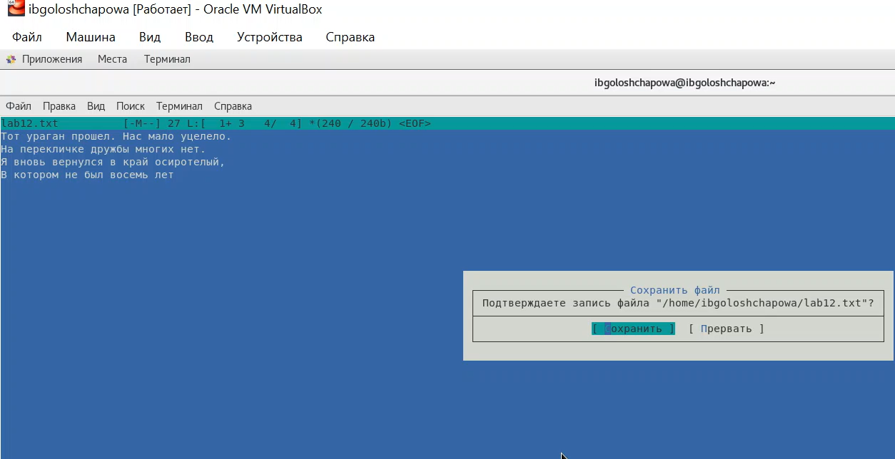
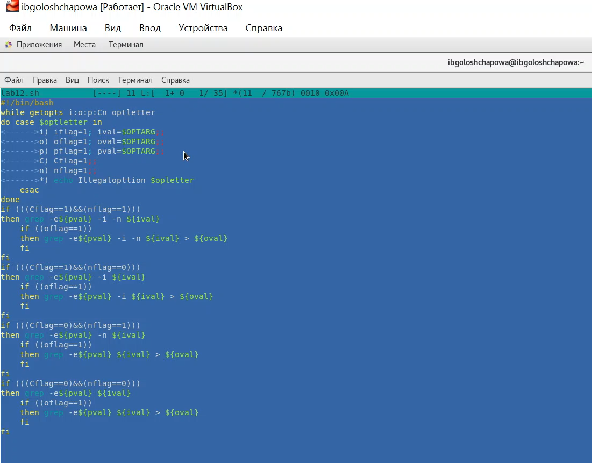
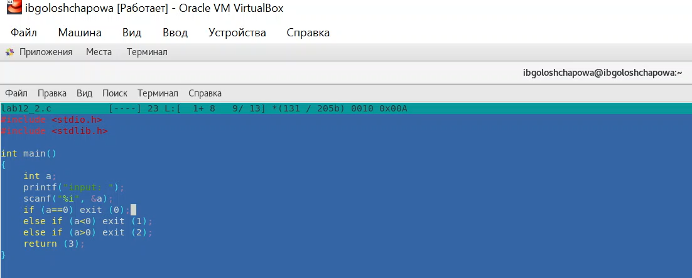
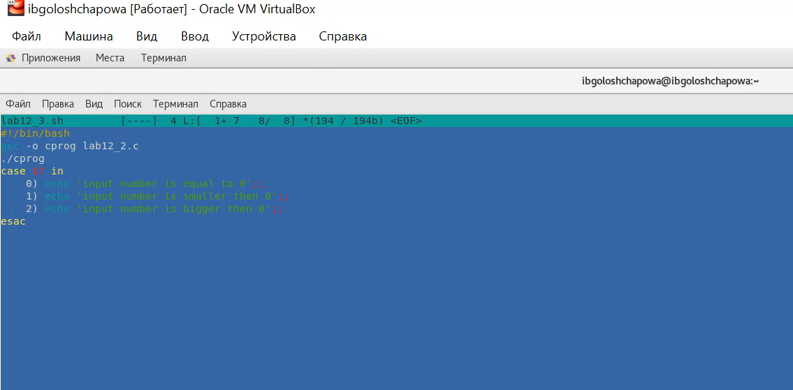
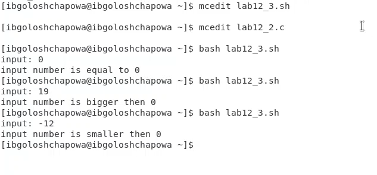
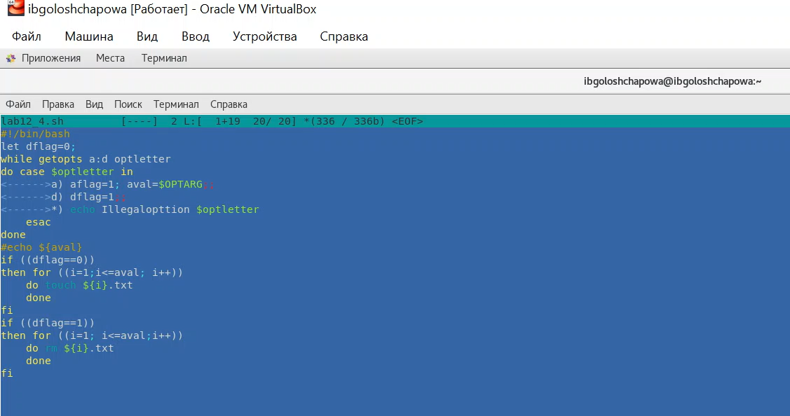

---
# Front matter
lang: ru-RU
title: "Отчёт по лабораторной работе №12"
subtitle: " Программирование в командном процессоре ОС UNIX. Ветвления и циклы"
author: "Голощапова Ирина Борисовна"

# Formatting
toc-title: "Содержание"
toc: true # Table of contents
toc_depth: 2
lof: true # List of figures
lot: true # List of tables
fontsize: 12pt
linestretch: 1.5
papersize: a4paper
documentclass: scrreprt
polyglossia-lang: russian
polyglossia-otherlangs: english
mainfont: PT Serif
romanfont: PT Serif
sansfont: PT Sans
monofont: PT Mono
mainfontoptions: Ligatures=TeX
romanfontoptions: Ligatures=TeX
sansfontoptions: Ligatures=TeX,Scale=MatchLowercase
monofontoptions: Scale=MatchLowercase
indent: true
pdf-engine: lualatex
header-includes:
  - \linepenalty=10 # the penalty added to the badness of each line within a paragraph (no associated penalty node) Increasing the value makes tex try to have fewer lines in the paragraph.
  - \interlinepenalty=0 # value of the penalty (node) added after each line of a paragraph.
  - \hyphenpenalty=50 # the penalty for line breaking at an automatically inserted hyphen
  - \exhyphenpenalty=50 # the penalty for line breaking at an explicit hyphen
  - \binoppenalty=700 # the penalty for breaking a line at a binary operator
  - \relpenalty=500 # the penalty for breaking a line at a relation
  - \clubpenalty=150 # extra penalty for breaking after first line of a paragraph
  - \widowpenalty=150 # extra penalty for breaking before last line of a paragraph
  - \displaywidowpenalty=50 # extra penalty for breaking before last line before a display math
  - \brokenpenalty=100 # extra penalty for page breaking after a hyphenated line
  - \predisplaypenalty=10000 # penalty for breaking before a display
  - \postdisplaypenalty=0 # penalty for breaking after a display
  - \floatingpenalty = 20000 # penalty for splitting an insertion (can only be split footnote in standard LaTeX)
  - \raggedbottom # or \flushbottom
  - \usepackage{float} # keep figures where there are in the text
  - \floatplacement{figure}{H} # keep figures where there are in the text
---

# Цель работы

Изучить основы программирования в оболочке ОС UNIX. Научится писать более сложные командные файлы с использованием логических управляющих конструкций и циклов.

# Библиография
[Командные файлы в Linux](https://sgww.livejournal.com/8836.html)

[Википедия - Командная оболочка](https://ru.wikipedia.org/wiki/Командная_оболочка_Unix)

[Программные процессоры](https://infopedia.su/24x10498.html)

# Выполнение лабораторной работы

1. Используя команды getopts grep, написала командный файл, который анализирует командную строку с ключами:
– -iinputfile — прочитать данные из указанного файла;
– -ooutputfile — вывести данные в указанный файл;
– -pшаблон — указать шаблон для поиска;
– -C — различать большие и малые буквы;
– -n — выдавать номера строк.
а затем ищет в указанном файле нужные строки, определяемые ключом -p.

*Рис.1 "Текстовый документ"*

*Рис.2 "Скрипт программы"*

2. Написала на языке Си программу, которая вводит число и определяет, является
ли оно больше нуля, меньше нуля или равно нулю. Затем программа завершается
с помощью функции exit(n), передавая информацию в о коде завершения в
оболочку. Командный файл должен вызывать эту программу и, проанализировав
с помощью команды $?, выдать сообщение о том, какое число было введено.

*Рис.3 "файл lab12_2.c"*

*Рис.4 "файл lab12_3.sh"*

*Рис.5 "вывод программы"*

3. Написала командный файл, создающий указанное число файлов, пронумерованных последовательно от 1 до N (например 1.tmp, 2.tmp, 3.tmp,4.tmp и т.д.).
Число файлов, которые необходимо создать, передаётся в аргументы командной
строки. Этот же командный файл должен уметь удалять все созданные им файлы
(если они существуют).

*Рис.6 "скрипт"*

*Рис.6 "скрипт"*

*Рис.6 "скрипт"*

4. Написать командный файл, который с помощью команды tar запаковывает в
архив все файлы в указанной директории. Модифицировать его так, чтобы запаковывались только те файлы, которые были изменены менее недели тому назад
(использовать команду find).

# Выводы

В ходе лабораторной работы я изучила основы программирования в оболочке ОС UNIX/Linux, а также научилась писать небольшие командные файлы.

# Контрольные вопросы

